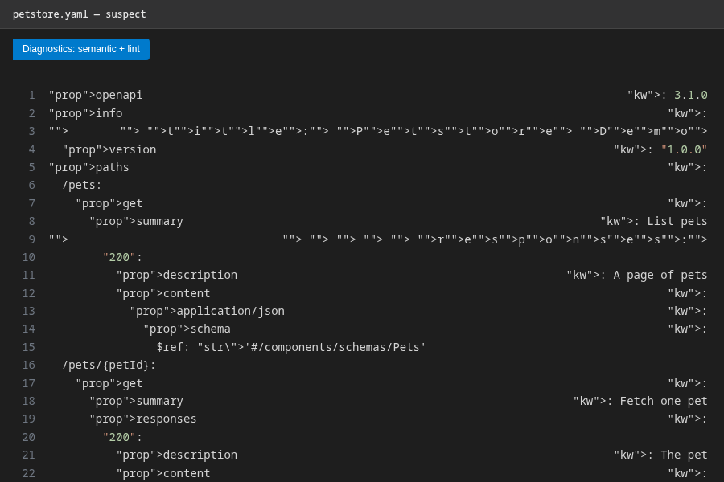
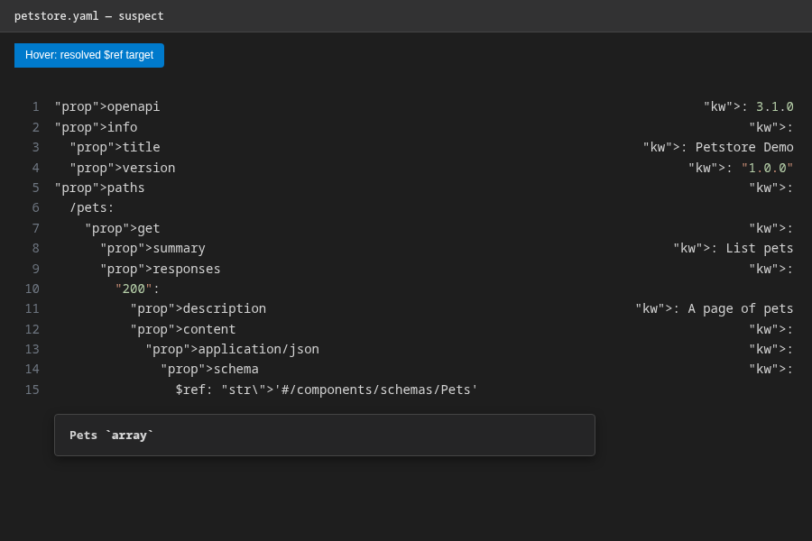
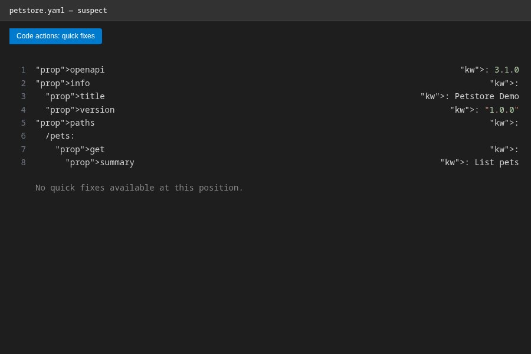
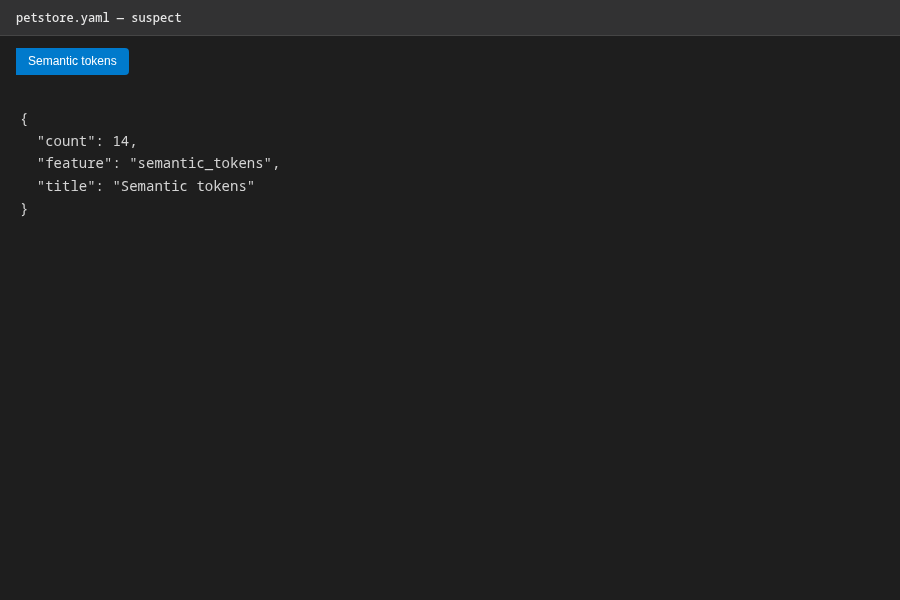
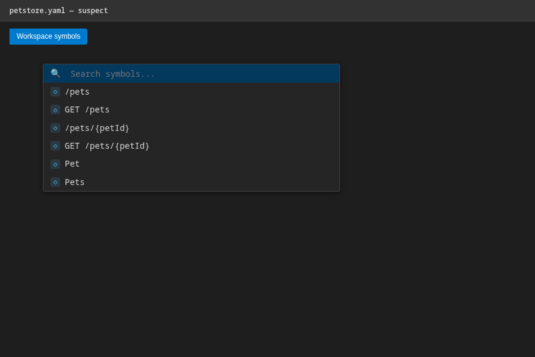
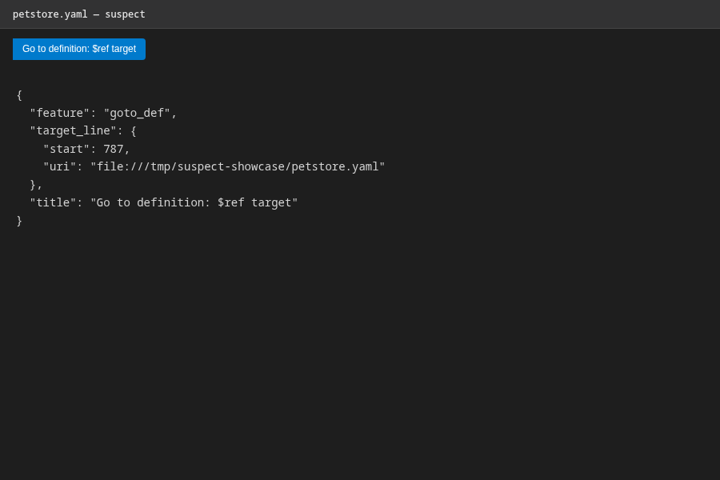

# suspect

High-performance Rust toolkit for OpenAPI (3.0, 3.1, 3.2; 2.0 read via family
sniffing), Arazzo 1.0, and Overlay 1.0: lossless tree-sitter parsing, native
`$ref` resolution with cycle classification, JSON Schema 2020-12 validation,
Spectral-compatible linting, an LSP server, and a CLI.

Design constraints: parse once, view many; zero-copy scalars; arena-indexed
nodes; lazy memoized resolution. Benchmarks with honest budget verdicts live
in [BENCHMARKS.md](BENCHMARKS.md).

## LSP — full-featured editor experience

`suspect lsp` is a complete language server for OpenAPI/Arazzo/Overlay files.
The repo ships a ready-to-use VS Code extension in
[`.vscode-suspect/`](.vscode-suspect/) (see its README for setup), and any LSP
client works — Neovim, Helix, Zed, Emacs (lsp-mode/eglot).

**Capabilities**: publishDiagnostics (syntax + 22 semantic checks + 21 lint
rules + Arazzo validation, debounced), goto-definition and references across
`$ref` boundaries (multi-file), hover with resolved target previews,
context-aware completions (`$ref` candidates from the workspace), quick fixes
and `source.fixAll.suspect`, document formatting, semantic highlighting,
`$ref`-target inlay hints, property type hints, document highlights,
selection ranges, rename with workspace-wide `$ref` rewriting
(`prepareRename` guarded), workspace symbols, folding ranges.

## How we compare

A detailed feature-by-feature comparison against **vacuum** (pb33f/daveshanley)
and **Telescope** (sailpoint-oss) is in
[docs/LSP_COMPARISON.md](docs/LSP_COMPARISON.md).

### In action (VS Code + the bundled extension)

Screenshots are reproducible via `docs/capture/capture.sh` (requires VS Code, Xvfb, xdotool, tesseract).

Diagnostics from the validator and linter, with `$ref` inlay hints:



Hover over a `$ref` resolves it across files and previews the target:



Quick fixes derived from diagnostics (insert missing `operationId`,
`responses`, `description`, contact/license skeletons, …):



Problems panel:


Semantic highlighting and property type hints:



Workspace-wide rename rewrites the declaration and every `$ref` that points
at it (guarded by `prepareRename`; cross-file edits land in one atomic
`WorkspaceEdit`) — shown here renaming `Pet`:



After applying, every `$ref` is rewritten:




## Crates

| Crate | Purpose | Tests |
|---|---|---|
| `suspect-source` | Loading: mmap, encodings (UTF-8/16, BOM), line indexes, URIs | 16 |
| `suspect-syntax` | Lossless tree-sitter CSTs (vendored grammars, patched for >32k-line YAML) | 7+1 |
| `suspect-low` | Ordered model, source maps, YAML 1.2 typing, aliases/merge keys, pointers | 20 |
| `suspect-ref` | `$ref` engine: workspace graph, cycle census (legal vs illegal), memos | 18 |
| `suspect-jsonpath` | RFC 9535 JSONPath over low nodes | 28 |
| `suspect-schema` | JSON Schema 2020-12 (unevaluated*, `$anchor`/`$id`, formats, `$dynamicRef`) | 31 |
| `suspect-oas` | Typed OpenAPI 3.x views; `$ref`-transparent, cycle-safe | 3 |
| `suspect-overlay` | Overlay 1.0 models + apply engine | 14 |
| `suspect-arazzo` | Arazzo 1.0 models, runtime expressions, cross-ref validation | 8 |
| `suspect-validate` | 22 semantic checks with stable diagnostic codes | 25 |
| `suspect-lint` | Spectral-compatible rulesets + 21 builtin rules | 31 |
| `suspect-lsp` | tower-lsp server: diagnostics, goto-def/references, hover, symbols, completion | 27 |
| `suspect-cli` | `suspect` binary: check, lint, overlay, fmt, stats, bundle, diff, bench, lsp | 15 |

## CLI

```console
$ suspect check spec.yaml              # parse + resolve report, cycle census
$ suspect lint spec/ --format json     # Spectral-style linting
$ suspect bundle api.yaml --strategy inline -o bundled.yaml
$ suspect overlay apply overlay.yaml api.yaml -o out.yaml
$ suspect diff old.yaml new.yaml
$ suspect stats api.yaml
$ suspect fmt api.yaml --json
$ suspect bench fixture.yaml           # per-stage timings
$ suspect lsp                          # stdio language server
```

## Notable engineering

- **Vendored grammars**: `crates/suspect-syntax/grammars/` with a local patch
  widening the YAML scanner's `int16_t` row tracking to `int32_t` — upstream
  tree-sitter-yaml v0.7.2 corrupts parses beyond 32,767 lines; suspect handles
  100k+-line documents (guarded by `crates/suspect-low/tests/large_yaml.rs`).
- **Cycle taxonomy**: `$ref` loops are classified as legal schema recursion or
  illegal (unresolvable) loops with exact cycle paths — never stack overflow,
  never hangs.
- **CI**: `.github/workflows/ci.yml` gates fmt, clippy (`-D warnings`), tests,
  and a bench smoke run.

## VS Code extension

```console
# build the server once
cargo build --release -p suspect-cli

# point the extension at it (or rely on `suspect` being on PATH)
mkdir -p ~/.vscode/extensions/suspect-lsp
cp -r .vscode-suspect/* ~/.vscode/extensions/suspect-lsp/
cd ~/.vscode/extensions/suspect-lsp && npm install vscode-languageclient@9
```

Then set `"suspect.server.path"` to the absolute path of the `suspect`
binary and reload the window. The `.vscode-suspect/README.md` documents the
full configuration surface.
