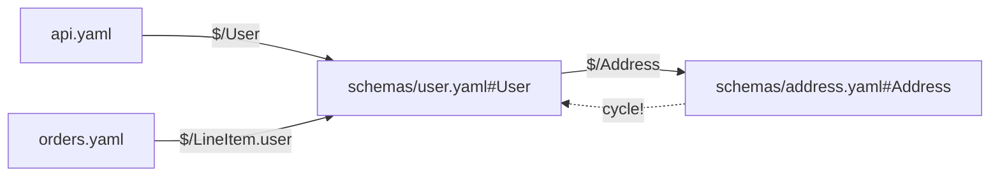

# LSP Feature Matrix — Full LSP 3.17 Specification Coverage

Every method in the LSP 3.17 specification evaluated for OpenAPI/Arazzo/Overlay
applicability. Each entry includes the concrete editor behavior and the
implementation approach using suspect's existing infrastructure.

**Status legend:** ✅ implemented · 🔴 should implement · 🟡 nice-to-have · ⚪ not applicable

---

## Contents

- [Text Document Synchronization](#text-document-synchronization)
- [Language Features](#language-features)
- [Workspace Features](#workspace-features)
- [Window & Progress](#window--progress)
- [Missing LSP 3.17 Methods](#missing-lsp-317-methods)
- [Quality & UX Deep-Dive](#quality--ux-deep-dive)
- [Priority Roadmap](#priority-roadmap)

---

## Text Document Synchronization

### ✅ `textDocument/didChange`

Buffer changed. Server takes the last range-less change as the new full text (full-sync mode declared in capabilities), re-parses into a fresh `LowDoc`, replaces the cached `OpenDoc`, and republishes diagnostics after the existing 150 ms debounce unless superseded. All position-based features (hover, completion, semanticTokens) read this live buffer, so unsaved edits immediately affect $ref navigation.

**Example:**

```yaml
#  user deletes the line `description: ok`
#  didChange { contentChanges: [{ text: <full new buffer> }] }
responses:
  '200': {}
# -> diagnostic: "Response must include a description" (oas-response-missing-description)
#    with the existing codeAction quick fix inserting `description: ...`
```

**Implementation:** Already wired (lib.rs `did_change`, full sync taking the last range-less change, 150 ms debounce). Optional upgrade: accept incremental range changes (client capability `textDocumentSync.incremental`) by applying `Range`ed edits against `OpenDoc.text` via the existing byte-offset helpers in state.rs (`offset_of_utf16`) instead of requiring full-text sync — less data over the wire for large specs.

### ⚪ `notebookDocument/didChange`

Notebook cell edits. Not an OpenAPI authoring surface.

**Example:**
```text
none
```

**Implementation:** Skip.

### ✅ `textDocument/didClose`

Editor closes the document. Server evicts the live `OpenDoc` from `State.open_docs`; subsequent queries fall back to reading the file from disk through `suspect_ref::Workspace`. Correct behavior additionally requires RE-PUBLISHING diagnostics computed from the disk copy, so e.g. a document closed with unsaved syntax errors doesn't leave stale errors pinned in the Problems panel.

**Example:**

```text
#  didClose(file:///api.yaml)
#  buffer had unsaved garbage `paths: [oops]`; server reloads from disk,
#  re-parses, republishes clean diagnostics; main.yaml's $ref edges now
#  resolve against the on-disk version again.
```

**Implementation:** Already wired (lib.rs `did_close`); extend it to read the file back via the same `Uri` plumbing used by `WorkspaceBuilder` and republish through the existing diagnostics pipeline. Small change, high consistency win.

### ✅ `textDocument/didOpen`

Editor opens a .yaml/.json OpenAPI/Arazzo/Overlay document. Server parses the buffer text into a `LowDoc` (suspect-low lossless tree), caches it as an `OpenDoc { text, low }` in `State.open_docs`, classifies the document family (OAS 2/3.0/3.1/3.2, Arazzo, Overlay via detection already in diagnostics.rs), runs the schema compiler + validation (suspect-schema/suspect-validate) and lint rules (suspect-lint), then publishes diagnostics.

**Example:**

```yaml
#  editor sends:
#  textDocument/didOpen { textDocument: { uri: file:///api.yaml, text } }
openapi: 3.1.0
info:
  title: Petstore
  # version missing -> 'oas-info-missing-version' published immediately
paths:
  /pets/{id}:
    get:
      responses:
        '200':
          description: ok
```

**Implementation:** Already wired (lib.rs `did_open`). Keep as-is; optionally warm the lazily-built `State.workspace` (`suspect_ref::WorkspaceBuilder`) here instead of on first navigation query, so goto-def/hover latency lands after didOpen rather than on first keystroke.

### ⚪ `textDocument/didSave`

Fires after the file is written to disk. Because suspect uses FULL text sync, the server already knows the exact buffer contents; the save conveys zero new information about open documents. Only conceivable use: opportunistically refreshing the on-disk view of OTHER files that reference this one — but those arrive via didChangeWatchedFiles anyway, and the current design already treats open-buffer text as authoritative over disk.

**Example:**

```yaml
# didSave adds nothing the server lacks:
openapi: 3.1.0
info: { title: T, version: "1" }
paths: {}
# diagnostics for `paths: {}` were already published during typing;
# the save itself carries no new information -> correctly ignored.
```

**Implementation:** tower-lsp `did_save` hook: clear ONLY this uri's stale-disk marker in `State.workspace`, keeping sibling documents' parsed trees alive (cheaper than the current full invalidation). ~10 lines.

### 🟡 `textDocument/willSave`

Notification fired just before the document is saved, with a `TextDocumentSaveReason` (Manual=1, AfterDelay=2, FocusOut=3). OpenAPI value is marginal because diagnostics are already pushed on every change; the only use is flushing the 150 ms debounce so the diagnostics shown at save time are guaranteed final rather than possibly one keystroke stale.

**Example:**

```yaml
#  user hits Ctrl+S on:
paths:
  /pets/:            # trailing-slash lint fires
    get: {...}
# willSave(reason=Manual): server flushes the pending debounce so the
# editor's saved-state gutter marker reflects the final diagnostics.
```

**Implementation:** One-line handler: tower-lsp `will_save` hook, set `State.debounce` generation for that uri to force immediate publication using the already-parsed `OpenDoc`. No new analysis code.

### 🟡 `textDocument/willSaveWaitUntil`

Request (not notification) fired before save; server returns `Vec<TextEdit>` that the CLIENT applies to the buffer before writing. Natural home for 'clean up my spec on save': auto-apply the deterministic, always-safe subset of suspect-lint quick fixes that already exist as codeActions — e.g. strip the trailing slash from a path key, insert a missing parameter `name:` placeholder — without user interaction.

**Example:**

```yaml
#  willSaveWaitUntil returns TextEdits applied by the client BEFORE the save:
paths:
  "/pets/":        # input
# server returns [{ range: <span of '"/pets/"'>, newText: '/pets' }]
# saved file contains:
paths:
  /pets:
    get:
      responses:
        '200':       # missing-responses fix inserts `description: ...` skeleton here
```

**Implementation:** Reuse `actions.rs`: iterate diagnostics produced by the normal pipeline, call the existing fix constructors (`trailing_slash_fix`, `pair_insert_fix`, `any_insert_fix`) filtered to deterministic, side-effect-free fixes; convert their `lsp_types::WorkspaceEdit` documentChanges into flat `Vec<TextEdit>`. Cap at N edits and bail out cleanly (return []) when any fix is non-applicable — willSaveWaitUntil blocks the save.

### 🔴 `workspace/didChangeConfiguration`

Receive user/workspace setting changes: which lint rules are enabled/disabled/downgraded (per-team Spectral-style policy), whether inlay hints for `$ref` resolution targets are shown, canonical-format indentation, and whether breaking-change-on-save runs against git base.

**Example:**

````markdown
Client posts updated settings:

```jsonc
// .vscode/settings.json
{
  "suspect.lint.rules": {
    "operation-tag-defined": "off",        // silence Spectral rule the team rejected
    "oas-operation-missing-operationId": "error"
  },
  "suspect.inlayHints.refTargets": true,
  "suspect.format.indent": 2
}
```
The server stores them in `State` and republishes diagnostics with the new severities.
````

**Implementation:** Implement tower-lsp's `did_change_configuration`: deserialize the `suspect` section into a `Config` struct held in `State`. Thread it into three places: `diagnostics.rs` severity mapping (override `Finding` levels from suspect-lint), `semantic::inlay_hints` gating, and `formatting` indent width (currently hardcoded two-space per the comment in `formatting`). After applying, call `client.publish_diagnostics` for all open docs.

### ⚪ `notebookDocument/didOpen` / `notebookDocument/didClose`

Notebook cell sync. OpenAPI/Arazzo specs are not authored in notebooks; no mapping from cells to spec documents exists.

**Example:**
```text
notebook-based API spec editors are not a suspect target
````

**Implementation:** Skip; no notebook client support planned.

### ✅ `workspace/didChangeWatchedFiles`

A watched file changed ON DISK (edited by another tool, git checkout, codegen output). Critical for multi-file OpenAPI/Arazzo projects where `main.yaml` `$ref`s `./schemas/pet.yaml`: the server drops its cached `suspect_ref::Workspace` so the next navigation query rebuilds $ref edges against fresh disk content, and dependent documents get re-diagnosed (e.g. a schema that stopped being valid JSON Schema now surfaces in main.yaml's $ref sites).

**Example:**

```yaml
#  user runs `sed -i 's/type: string/type: integer/' components/pet.yaml`
#  while main.yaml holds:
schema:
  $ref: './components/pet.yaml#/Pet'
# didChangeWatchedFiles fires -> cache dropped -> next hover over the $ref
# shows `integer` and validation of main.yaml reflects the new type.
```

**Implementation:** Already wired (lib.rs `did_change_watched_files`, wholesale drop). Targeted refinement: map each changed `FileEvent.uri` to its node in the `suspect_ref` graph and invalidate only edges touching it, then walk INCOMING $ref edges to find dependent documents and republish their diagnostics — avoids rebuilding the whole workspace on every external touch in large multi-file API projects.

### 🟡 `workspace/didChangeWorkspaceFolders`

Root folders are added/removed from a multi-root workspace. Suspect currently builds ONE ref workspace from a single root; supporting this makes multi-root setups work — e.g. a monorepo where `services/petstore/openapi.yaml` and `services/billing/arazzo.yaml` live in separate folders sharing `packages/common-schemas/`. Adding a folder brings its documents into $ref resolution and diagnostics; removing one drops them and re-diagnoses remaining docs for now-unresolvable refs.

**Example:**

```text
#  monorepo: user adds folder `catalog/` containing catalog/api.yaml which
#  $refs '../shared/schemas/common.yaml'
#  didChangeWorkspaceFolders{added:[catalog]} -> shared/schemas/common.yaml
#  becomes reachable; goto-def from catalog/api.yaml resolves cross-folder.
```

**Implementation:** Add `workspace_folders` to `State` (from `initialize` params, which tower-lsp already delivers); extend `WorkspaceBuilder` construction in state.rs to take the root list and thread it through the existing lazy-build path. No per-feature changes needed since all features query the workspace abstraction.

### 🔴 `workspace/didCreateFiles`

A new file appears under workspace control (explorer 'new file', git checkout of a previously missing ref target). Today the lazily-built workspace eventually picks it up only after some other cache drop. Proper handling: immediately index the new file into the `suspect_ref::Workspace` so cross-file `$ref: './new-file.yaml#/X'` resolves right away, and push diagnostics for the UNOPENED file — a newly created Arazzo `workflow.yaml` pointing at a nonexistent source should be flagged before the user even opens it.

**Example:**

````markdown
Creating `schemas/coupon.yaml` next to an existing spec:

```yaml
# coupon.yaml (new)
Coupon: {type: object, properties: {code: {type: string}}}
```
No immediate action needed; the cache-drop makes the next `goto_definition` on a pre-existing `$ref: './schemas/coupon.yaml#/Coupon'` succeed.
````

**Implementation:** tower-lsp `workspace/did_create_files` hook: for each created uri with a supported extension (.yaml/.yml/.json), parse via `OpenDoc::parse`, classify family, run validate+lint, publish. Insert into the ref workspace WITHOUT dropping the whole cache (mirror the targeted-invalidation path recommended for didChangeWatchedFiles).

### ⚪ `workspace/didCreateFiles / didRenameFiles / didDeleteFiles`

Post-hoc cache invalidation for created/renamed/deleted spec files. Functionally redundant with the already-implemented `did_change_watched_files` (which drops the whole ref-Workspace cache) whenever clients have file watchers configured — but they fire deterministically even when the watcher misses events, and rename gives you old+new URIs in one shot.

**Example:**

````markdown
Creating `schemas/coupon.yaml` next to an existing spec:

```yaml
# coupon.yaml (new)
Coupon: {type: object, properties: {code: {type: string}}}
```
No immediate action needed; the cache-drop makes the next `goto_definition` on a pre-existing `$ref: './schemas/coupon.yaml#/Coupon'` succeed.
````

**Implementation:** tower-lsp `did_create_files`: same body as today's `did_change_watched_files` (`st.workspace = None`). Could be skipped entirely while the watcher glob covers `**/*.{yaml,yml,json}`; adopt only if users configure narrow watchers that miss new spec files.

### 🔴 `workspace/didDeleteFiles`

A file is deleted. Server removes it from the ref workspace; every document holding a `$ref` into it must immediately receive an unresolvable-$ref validation error at each ref site (falls out naturally from suspect-validate once the node disappears), instead of waiting for an unrelated cache drop. If the deleted file was OPEN with unsaved edits, treat like didClose. Bonus: a codeAction at each broken $ref offering to recreate the file from the expected shape.

**Example:**

```yaml
#  user deletes components/pet.yaml; main.yaml contains two $ref sites to it:
schema:
  $ref: './components/pet.yaml#/Pet'   # -> error: cannot resolve $ref (x2)
# codeAction on either offers: "Recreate components/pet.yaml"
```

**Implementation:** tower-lsp `workspace/did_delete_files` hook: remove nodes/edges from the ref workspace, evict `open_docs` entry, then reuse the incoming-edge walk (same as the didChangeWatchedFiles refinement) to republish dependents. The 'recreate file' codeAction slots into the existing `code_actions` dispatch table keyed by diagnostic code.

### 🔴 `workspace/didRenameFiles`

Notification AFTER a rename happened. Server must move its cached `OpenDoc` under the new uri (if the file was open), remap the ref-workspace node, and revalidate: documents that pointed at the OLD path now resolve against the NEW one. Pure bookkeeping — the user-visible $ref rewriting belongs to the `workspace/willRenameFiles` REQUEST above; this notification keeps internal state consistent when the rename happened outside a willRename round-trip (e.g. plain filesystem mv picked up by watchers).

**Example:**

```text
#  didRenameFiles(schemas/user.yaml -> schemas/account.yaml):
#  open_docs key replaced; every $ref edge retargeted;
#  diagnostics for main.yaml republished with zero unresolved-ref errors.
```

**Implementation:** Factor a shared `apply_file_move(old_uri, new_uri)` helper in state.rs touching `State.open_docs` keys and the ref-graph node table; call from the tower-lsp `did_rename_files` hook.

### 🟡 `workspace/willCreateFiles`

Paired REQUEST for didCreateFiles: server may return a WorkspaceEdit applied before the file is created (e.g. scaffolding a new component file). For OpenAPI there is no safe universal scaffold — we don't know if a new yaml is a schema module, an Arazzo workflow, or unrelated config — so returning `None` is correct. Marginal option: when created INSIDE a conventional `components/schemas/` directory of a known spec, offer a typed-view-aware empty-schema skeleton.

**Example:**

```yaml
#  willCreateFiles(components/webhooks/refund.yaml) -> server returns null
#  (opt-in scaffold variant could return edits creating:
RefundRequested:
  type: object
  properties: {}
# but blocking save on scaffolding is opinionated)
```

**Implementation:** tower-lsp `will_create_files` hook returning `Ok(None)` initially; scaffolding, if ever added, generates YAML via the serializers actions.rs already uses (`value.to_yaml()` / `to_json_pretty()` respecting file extension).

### 🟡 `workspace/willDeleteFiles`

Paired REQUEST for didDeleteFiles: server may return edits preparing OTHER files for the deletion. Tempting idea — auto-remove `$ref` sites pointing at the doomed file — but almost always WRONG for OpenAPI: deleting `pet.yaml` should surface broken refs as errors the user resolves deliberately (inline the schema? drop the endpoint?), not have refs silently excised. Return `None`; keep deletion loud.

**Example:**

```text
#  willDeleteFiles(components/pet.yaml) with 4 incoming refs -> return null
#  (silently stripping refs would corrupt main.yaml's structure; deletion
#  should surface broken refs as deliberate follow-up work instead)
```

**Implementation:** tower-lsp `will_delete_files` hook: consult incoming-edge count in the ref graph; if >0 return Ok(None) and let the delete proceed — didDeleteFiles then produces the broken-ref diagnostics described above. Never auto-generate structural deletions.

### 🔴 `workspace/willRenameFiles`

Paired REQUEST for didRenameFiles and the single highest-value missing sync-area feature: when the user renames a referenced file in the explorer, the server returns a WorkspaceEdit rewriting every `$ref: './old.yaml#/...'` across the workspace to the new path BEFORE the rename lands. Without it, renaming any multi-file spec component silently breaks every referrer until hand-fixed.

**Example:**

```yaml
#  willRenameFiles(components/pet.yaml -> components/animal.yaml) returns edits:
# main.yaml before:
schema:
  $ref: './components/pet.yaml#/Pet'
# after applying returned WorkspaceEdit:
schema:
  $ref: './components/animal.yaml#/Pet'
#  then didRenameFiles invalidates the old node and indexes the new path.
```

**Implementation:** Two pieces: (a) `will_rename_files` request — for each renamed uri, walk incoming $ref edges in the ref graph, rewrite the file-part of each `$ref` string (preserving fragment and quote style via the low-tree scalar-edit helpers used by rename.rs), return `WorkspaceEdit`; (b) notification half handled under didRenameFiles below. The reverse-edge lookup is the same machinery references/goto-def already use in navigation.rs.

## Language Features

### 🟡 `codeAction/resolve`

Defer expensive edit computation until the user actually picks an action. Today every codeAction request computes all WorkspaceEdits eagerly (fix_for + fixAll aggregation). With resolve, the initial request returns cheap titles+kinds with `data`, and edits are built only for the chosen action — matters for the fix-all path which aggregates and de-conflicts every diagnostic in the file.

**Example:**

```text
Client sends `codeAction/resolve` with `data: {"kind":"source.fixAll.suspect","gen":42}`; server recomputes `all_edits(doc, &diagnostics)` once instead of on every keystroke-triggered codeAction batch.
```

**Implementation:** Advertise CodeActionProviderCapability::Options { resolve_provider: true }. In `code_action`, return actions with `edit: None` and opaque `data` (action kind + diagnostic coordinates + State::generation for staleness checks). Implement tower-lsp's `code_action_resolve` by rebuilding edits via `actions::fix_for`/`all_edits` from the stored code+range. Low risk because fix computation is already factored into pure functions.

### 🔴 `codeLens/resolve`

Required companion: compute the expensive bits (reference counts via workspace edge scan, command arguments) only for lenses scrolled into view, keeping the full-lens pass trivially fast.

**Example:**

```text
Resolve turns `data: {"ptr":"#/components/schemas/Pet"}` into title `3 refs` + range of the `Pet:` key, counting matching RefEdges in the cached Workspace.
```

**Implementation:** Same module as codeLens: `code_lens_resolve` reads the pointer from `data`, queries `suspect_ref::Workspace` edge counts (or `navigation::references` for the command variant), fills `range` and `command`. Must handle stale generation gracefully (return the lens unchanged rather than erroring).

### 🔴 `completionItem/resolve`

Lazily enrich a completion item when the user selects/hovers it. For `$ref` candidates, resolve would attach the referenced component's rendered YAML excerpt and its `description` as `documentation`, without paying the cost of excerpt-rendering every candidate during the initial request (important for specs with hundreds of schemas).

**Example:**

```text
Item `#/components/schemas/Pet` resolves to markdown: '```yaml\nPet:\n  type: object\n  properties:\n    id: {type: integer}\n```\nA pet that can be sold.' — computed only if the user hovers the item.
```

**Implementation:** Set `resolve_provider: Some(true)` in CompletionOptions; give each item `data: Some(json!({"ptr": <target-pointer>, "uri": <def-uri>}))`. In `completion_item_resolve`, look the pointer up in `suspect_ref::Workspace` (already cached, invalidated by did_change_watched_files), extract the target node via the existing `excerpt()` helper in navigation.rs (which already renders bounded YAML excerpts for hover), and return the item with documentation filled in. Mirrors how tower-lsp exposes `completion_resolve`.

### 🟡 `documentLink/resolve`

Lazily fill `target`/`tooltip` for a link whose `data` was set in the initial pass. Useful only if we later want to avoid resolving cross-file `$ref` targets during the main pass on huge multi-file workspaces.

**Example:**

```text
The link on `https://spec.openapis.org/oas/v3.1.0` resolves to tooltip 'External documentation — opens in browser'.
```

**Implementation:** Only worth pairing with a deferred-link design (data carries the raw string; resolve attaches target+tooltip). Given our links are cheap to compute eagerly, ship plain documentLink first; resolve is optional polish. If added: advertise resolve_provider:true and implement tower-lsp's `document_link_resolve` reusing the eager computation.

### 🟡 `inlayHint/resolve`

Lazy tooltip/detail for inlay hints: the base pass emits positions+labels cheaply; resolve adds the full hover-grade markdown (schema summary of the $ref target) only for visible hints.

**Example:**

```text
resolve(hint at $ref) → `tooltip: "Pet — object; id, name, tag; referenced 7×"` via render_schema_node
```

**Implementation:** Advertise `InlayHintOptions { resolve_provider: true }`; resolve resolves the pointer through the workspace and reuses hover_detail renderers. Only worth it once hints carry rich tooltips.

### ✅ `textDocument/codeAction`

Quick fixes keyed by suspect's own diagnostic codes (lint rule violations from suspect-lint, validation errors from suspect-validate, syntax repairs): e.g. insert missing `description` on a response, quote an unquoted numeric path template, remove unused server variable defaults, wrap non-string scalars. Plus a `source.fixAll.suspect` action applying all non-conflicting fixes document-wide.

**Example:**

```text
Diagnostic 'missing required field description' on a response -> action 'Add missing description: OK'; overlapping edits dropped in Fix All to keep the edit set conflict-free.
```

**Implementation:** Complete: `actions::code_actions()` maps diagnostic `code` -> `fix_for()` builders, caps at 20 actions, appends `source.fixAll.suspect` when range covers the document.

### 🔴 `textDocument/codeLens`

IntelliJ-style adornments above operations and components. Above each path item: one lens per verb rendering `GET /pets` (click -> outline/references). Above each component under components/schemas|parameters|responses: a lens `N refs` (click -> textDocument/references on that component). Above `openapi:` a lens showing the version and detected dialect. Lenses make reference-count visibility zero-effort, complementing the explicit references request.

**Example:**

```text
Above `  /pets:` a lens `[get] [post]`; above `    Pet:` a lens `3 refs`; above `  /pets/{id}:` a lens `GET /pets/{id} — Find pet by ID`. Clicking `3 refs` runs find-references on Pet.
```

**Implementation:** New `codelens.rs`: walk `OpenApi::operations()` typed view for verb lenses (each yields the Pair node range -> CodeLens with command `suspect.showRefs` and data=pointer); walk components for ref-count lenses (count RefEdges per target from `suspect_ref::Workspace` — cheap since edges are precomputed). Register `code_lens_provider: Some(CodeLensOptions { resolve_provider: Some(true) })` and implement `code_lens` + `code_lens_resolve` on Backend. Counts go in resolve so lens positions stay cheap on every keystroke.

### ⚪ `textDocument/colorPresentation`

Pickers for editing color literals. Empty for the same reason as documentColor.

**Example:**

```text
none
```

**Implementation:** Skip (pairs with documentColor).

### ✅ `textDocument/completion`

Context-aware completion of object keys and `$ref` target values. At a mapping-key position, offers the keys valid for the enclosing OAS object (operation keys, schema keys, parameter keys...). At a `$ref:` value position, offers every resolvable pointer target in the workspace (components/schemas/*, parameters/*, responses/*, path items, external-file refs), ranked with the local document first.

**Example:**

```text
Cursor after `type: ` offers [object, string, integer, ...]; cursor after `$ref: ` offers '#/components/schemas/Pet', '#/components/schemas/Order', ... filtered to schemas when under `properties`.
```

**Implementation:** Already wired: `completion::context_at()` discriminates Keys/Refs/None from the syntax tree; `key_items()` serves static tables (OPERATION_KEYS, SCHEMA_KEYS, RESPONSE_KEYS, PARAMETER_KEYS, etc.) and `ref_items(ref_candidates(&ws, uri))` serves $ref targets from `suspect_ref::Workspace`. No further work needed beyond adding more key tables (e.g. securitySchemes, encoding).

### 🟡 `textDocument/declaration`

Marginal in OAS because `$ref` targets are simultaneously their own declaration and definition (there is no separate forward declaration like C). The one meaningful distinction: jumping from a `$ref` to the component *key declaration line* (`Pet:` under components/schemas) versus its full body. Also usable for path-item `$ref`s to land on the referenced file's root `paths` mapping.

**Example:**

```text
In `$ref: './paths/pets.yaml'` (a path-item $ref), declaration jumps to the top-level `paths:` key of pets.yaml where it is declared; definition jumps to the actual Path Item Object content.
```

**Implementation:** Reuse `navigation::goto_definition()` but stop at the *parent key pair* of the resolved target rather than the value node: from the Definition returned by the Workspace edge lookup, walk up one Pair in the target document's LowDoc tree and emit its key range. ~20 lines wrapping existing logic; register `declaration_provider: Some(OneOf::Left(true))`.

### ✅ `textDocument/definition`

Go-to-definition through `$ref` edges: cursor on a `$ref` value jumps to the pointed-at node (schema, parameter, response, header, example, requestBody, callback, link, securityScheme, path item), crossing file boundaries within the workspace. Also supports jumping from a path entry like `/pets/{id}` to its Path Item body.

**Example:**

```text
`$ref: "#/components/schemas/Pet"` under a 200-response jumps to `components:\n  schemas:\n    Pet:` — even when Pet lives in another file of the multi-document workspace.
```

**Implementation:** Complete: `navigation::goto_definition()` walks RefEdges from `suspect_ref::Workspace` (which resolves intra-file pointers, sibling files, and remote files); `to_location()` prefers the dirty open buffer over the disk copy. `self_definition()` additionally lets you jump from a component key back to itself for the references workflow.

### ⚪ `textDocument/documentColor`

Color swatches for color literals. OpenAPI has no color-typed fields; hex codes appear only inside free-text descriptions/examples where a swatch is misleading (they aren't semantic colors of the API).

**Example:**

```text
none
```

**Implementation:** Skip.

### 🟡 `textDocument/documentColor + textDocument/colorPresentation`

Color swatches for hex/CSS color strings appearing inside example/default/enum values — relevant for design-token-style APIs that describe colors (`format: hex-color` conventions have no official OAS status, hence marginal). colorPresentation supplies the textual edit when the user picks a color from the swatch picker.

**Example:**

```text
none
```

**Implementation:** Scan string scalars under keys `value`/`default`/`const`/`enum` items matching `^#[0-9a-fA-F]{3,8}$` (plus named CSS colors optionally). Emit Color{lsp_range of the scalar, red/green/blue/alpha floats}; colorPresentation maps picked color back to `#rrggbb` TextEdit. Pure lexical scan over the existing tree — no schema involvement. Register both providers together (clients expect the pair).

### 🔴 `textDocument/documentLink`

Make URLs and refs clickable: every `url` under `info.contact`, `info.license`, `externalDocs` (root, tag, operation levels), `termsOfService`, and `$ref` values pointing at other workspace files become hyperlinks. Ctrl+Click on `./common.yaml#/components/schemas/Pet` opens that file at the right position; Ctrl+Click on externalDocs opens the browser.

**Example:**

```text
On `termsOfService: https://api.example.com/tos` and on `$ref: './common.yaml#/components/schemas/Pet'`, Ctrl+Click opens the URL / jumps into common.yaml respectively.
```

**Implementation:** New function scanning Pairs: keys `url`, `externalDocs`, `termsOfService`, `email` (mailto:) -> DocumentLink{range: scalar range, target: Url}. For `$ref` values: parse via `ParsedRef` from suspect-ref::edges; intra-document pointers become links to the same URI with a `selection` range from `lsp_range` of the target; cross-file pointers target the resolved file URI. Advertise `document_link_provider: Some(DocumentLinkOptions { resolve_provider: Some(false) })`. Straightforward given `navigation::goto_definition` already computes target locations — factor out target-location lookup shared with goto_definition.

### ✅ `textDocument/foldingRange`

Fold every nested mapping/sequence (paths, per-operation objects, schema trees, components categories) plus multi-line scalars (long `description` blocks, examples) and comment runs. Enables collapsing entire endpoint groups or the whole components section.

**Example:**

```text
Folding collapses `components:\n  schemas:` down to one line, and folds long description scalars to their first line.
```

**Implementation:** Complete: `symbols::folding_ranges(&doc.low)` derives ranges from collection nesting depths and multi-line scalars.

### ✅ `textDocument/formatting`

Full-document canonical formatting: parse → materialize → re-emit as YAML (or pretty JSON for .json files) with two-space indent. A semantic round-trip, not whitespace shuffling, so key order and quoting normalize too.

**Example:**

```text
Shift+Alt+F → the whole file re-emitted: consistent 2-space indent, quotes normalized, keys in canonical order — semantics preserved via OverlayValue round-trip
```

**Implementation:** Implemented in `actions::format_document` via `OverlayValue::from_node` re-emission; refuses to format on syntax errors (would silently drop content) and for non-collection roots. Reads `.json` URIs to pick pretty JSON output.

### ✅ `textDocument/hover`

Markdown hover on any node. On a `$ref` value: renders the resolved target's YAML excerpt (bounded), its `title`/`description`, and the pointer. On an operation/keyword: shows OAS spec documentation for the keyword and, for e.g. `operationId` or a tag name, cross-links to related nodes.

**Example:**

```text
Hover over `#/components/schemas/Pet` in `$ref:` shows the Pet schema source plus 'A pet that can be sold.'; hover over `required` shows the Schema Object keyword docs.
```

**Implementation:** Existing `navigation::hover_markdown(&ws, &low, offset)` handles $ref targets, self-definitions, excerpts, descriptions, and keyword docs (hover_detail.rs adds OAS keyword documentation tables). Complete.

### 🟡 `textDocument/implementation`

Weak analogue at best: from a component schema, list concrete 'implementations' — e.g. inline schemas that `allOf` it, discriminated mappings that map discriminator values to it, or examples conforming to it. In practice this is exactly the inverse-$ref query that `references` already answers, and 'examples conforming to it' belongs to validation, not navigation.

**Example:**

````markdown
```yaml
schemas:
  Pet:      # <- implementation here lists every location whose schema resolves to Pet
```
````

**Implementation:** Thin wrapper: filter `Workspace` RefEdges whose parsed target equals the node under the cursor (`ParsedRef` gives normalized target identity), map to Locations via the existing `to_location`. However this duplicates `references` (which already includes $ref usage sites), so the marginal value is near zero. Recommend skipping.

### ✅ `textDocument/inlayHint`

Ghost text: resolved `$ref` target names inline after the ref string, inferred types on schema keys, missing-required markers, and parameter `in:`/`name` reminders. Answers 'what does this resolve to?' without hovering.

**Example:**

```text
on `responses:` under `get:` → faint `missing description` hint; on `type: string` with `minLength` → faint `string · 1..64` constraint summary; on a `$ref` → faint resolved target name `→ Pet`
```

**Implementation:** Implemented in `semantic::inlay_hints` (range-scoped, workspace-aware). Extension: reuse `push_constraints` from hover_detail for constraint summaries and `parse_live_ref` for resolved-target hints.

### ✅ `textDocument/inlayHint (+ inlayHint/resolve)`

Two hint families, first already shipped: (1) after each `$ref` value, an inline hint showing the resolved short pointer/target file so readers see what a ref points at without navigating; (2) after each property key under `properties:`, a `: type` hint showing the property's schema type (following $refs). The resolve companion would defer tooltip construction (full component excerpt) until hover-on-hint.

**Example:**

```text
on `responses:` under `get:` → faint `missing description` hint; on `type: string` with `minLength` → faint `string · 1..64` constraint summary; on a `$ref` → faint resolved target name `→ Pet`
```

**Implementation:** Hints themselves complete: `semantic::inlay_hints(doc, &ws, range)` with MAX_HINTS cap, covering both $ref targets (resolved through the Workspace handle) and property types. Only the resolve half is missing: give hints `data` (pointer) and implement tower-lsp's `inlay_hint_resolve` attaching `tooltip` (rendered excerpt via navigation::excerpt) or padding/textEdits on demand. Worth doing together with completionItem/resolve since both need a shared 'render component docs' helper.

### ⚪ `textDocument/inlineValue`

Debugger-only feature: variable values shown inline at the paused location. An OpenAPI/Arazzo document is data, not executed code — there is no evaluation context, no variables, no pause locations.

**Example:**

```text
During a debug session stopped at a client SDK generated from the spec, inlineValue could show `pet.id = 7` beside `id:` — requires correlating runtime frames with spec text, which no OAS workflow does.
```

**Implementation:** Not applicable. Requires a debug adapter session (DAP) whose stack frames correspond to positions in the document; OpenAPI documents are declarative interface definitions, never executed. Do not advertise.

### 🟡 `textDocument/linkedEditingRange`

Multi-cursor live-edit coupling: when the cursor is on a component key, also place editable cursors on the final segment of every `$ref` string in the same document that names it, so typing the new name updates all occurrences synchronously — instant feedback before committing a real rename.

**Example:**

```text
Renaming `components.schemas.Pet`'s key live-updates the colored ranges of all four `$ref: '#/components/schemas/Pet'` strings in the same file so they always spell the same name.
```

**Implementation:** Reuse rename.rs's target discovery: `prepare_rename` at the key gives the primary range; collect intra-document `$ref` values resolving to that component via Workspace edges restricted to the same URI, taking the final-segment sub-range of each ref string. Advertise `linked_editing_range_provider: Some(OneOf::Left(true))`. Multi-file refs excluded by design (linked editing is inherently same-document).

### ✅ `textDocument/prepareRename`

Validate renameability and show the placeholder: returns the exact range of the renameable token (component key, or the final pointer segment inside each `$ref` string) so clients grey out rename on non-renameable positions (arbitrary YAML keys, descriptions, URLs) with an explanatory error.

**Example:**

```text
prepare_rename on the `#/components/...` prefix of the ref string errors ('position is not on a renameable component key'); on `Pet` itself returns placeholder `Pet` covering exactly the last segment.
```

**Implementation:** Complete: `rename::prepare_rename(doc, offset)` validates the position sits on a component key or its ref-string tail segment and reports honest failure otherwise.

### ✅ `textDocument/references`

Find all usages: on a component key (e.g. `Pet:` under components/schemas), returns every `$ref` pointing at it across all workspace documents (paths, webhooks, other components, Arazzo documents that reference the spec); on a `$ref` value, returns peer refs to the same target. Declaration included per `includeDeclaration`.

**Example:**

```text
References on `Pet:` returns every `$ref: '#/components/schemas/Pet'` occurrence plus the declaration; toggling includeDeclaration off drops the `Pet:` line.
```

**Implementation:** Complete: `navigation::references()` scans reverse RefEdges across the whole `suspect_ref::Workspace`, honoring `include_declaration`.

### ✅ `textDocument/rename`

Rename a component key (schema, parameter, response, securityScheme, tag name, path template placeholder like `{id}`) with workspace-wide `$ref` rewriting — including refs in other files and in Arazzo documents that consume the spec. Tag renames also update `tags:` entries on operations.

**Example:**

```text
Rename `Pet:` to `Cat:` rewrites the key plus all five `$ref: '#/components/schemas/Pet'` occurrences across paths.yaml and schemas.yaml in one WorkspaceEdit.
```

**Implementation:** Complete: `rename::prepare_rename` returns RangeWithPlaceholder or honest invalid_params error; `rename::rename` uses Workspace edges to rewrite every inbound $ref across files, respecting open-dirty buffers via to_location's counterpart editing logic.

### ✅ `textDocument/selectionRange`

Syntactic expand-selection chain following YAML/OAS nesting: scalar value -> key-value pair -> enclosing mapping/sequence entry -> ... -> document root. Lets Alt+Shift+Up grab exactly one schema property, then the whole properties block, then the whole schema.

**Example:**

```text
Cursor on the `integer` scalar in `type: integer` expands: scalar -> `type` pair -> properties mapping -> Pet mapping -> schemas -> components -> root.
```

**Implementation:** Complete: `semantic::selection_ranges(doc, positions)` climbs Pair->Collection ancestors from the syntax tree.

### ✅ `textDocument/semanticTokens/full`

Full-document token classification with OAS-aware legend: keys typed by role (property names vs OAS keywords vs path templates vs media types vs HTTP verbs), `$ref` strings as their own class, enum values, deprecated markers (modifier), extension keys `x-*` distinguished from standard keys. Enables precise theming: e.g. dimming x- extensions, bolding verbs.

**Example:**

```text
`$ref: '#/components/schemas/Pet'` gets keyword+string tokens; `deprecated: true` marks `true` as modifier `deprecated` so themes can strike it through.
```

**Implementation:** Complete: `semantic::legend()` + `semantic::semantic_tokens_full(doc)` walk the tree emitting tokens with OAS-specific modifiers.

### 🟡 `textDocument/semanticTokens/full/delta`

Incremental token sync: client sends previous resultId, server responds only with token edits since that version. Pure bandwidth/CPU optimization for large specs where every keystroke currently re-sends the entire token array.

**Example:**

```text
After typing `  newKey: v` (one token delta) the server returns edits=[{startDelta:0, deleteCount:0, tokens:[newToken]}] instead of re-emitting 50k tokens for a big spec.
```

**Implementation:** Cache the last SemanticTokens + State::generation per open doc in State; on `semantic_tokens_full_delta`, recompute full tokens and run the standard LSP diff algorithm over (line,col,type,mods) quintuples. Mechanical once full tokens exist; only worthwhile when telemetry shows large specs dominating token traffic. tower-lsp provides the `SemanticTokensFullOptions::Delta{delta_format}` capability flag.

### 🟡 `textDocument/semanticTokens/range`

Tokens for just the visible viewport. Cheaper than full for huge specs; some clients request range-first and fall back to full.

**Example:**

```text
Scrolling inside components/schemas requests tokens for lines 400–600 only; server slices the full token vector to that window.
```

**Implementation:** Trivial wrapper: compute full tokens (already O(total)), binary-search the SemanticTokens deltas for the first token at/after range.start.line, emit until range.end.line, rebasing startLine/startChar of the first token. Flip `range: Some(true)` in SemanticTokensOptions. ~30 lines; do it whenever a client asks for it.

### ⚪ `textDocument/signatureHelp`

Not applicable in the classic sense: YAML/JSON mappings have no function-call syntax, so there are no parameter lists to annotate. The closest analogue (showing which keywords take which value shapes, e.g. `items` takes one schema, `required` takes a string array) is better served by hover and validation diagnostics.

**Example:**

````markdown
There is no callable expression anywhere in:
```yaml
responses:
  '200':
    description: OK
```
Nothing corresponds to `foo(<args>)`, so there is no signature to display.
````

**Implementation:** Not applicable. If ever desired, the only conceit would be showing allowed-value tables for enum-ish keywords, but that duplicates hover and would confuse clients that render signatures as `name(param1, param2)`. Skip; do not advertise the capability.

### 🔴 `textDocument/typeDefinition`

From a *usage site* of a typed slot, jump to the schema that types it. Cursor on: (1) a property name under `properties:` -> its value schema (following `$ref`); (2) a media-type key like `application/json` -> its `schema`; (3) a parameter name -> its `schema`; (4) a response code -> response schema(s); (5) `items`/`prefixItems` entries -> element schema. This is the highest-value unimplemented navigation: 'what does this field contain?'

**Example:**

````markdown
```yaml
properties:
  pet:            # <- cursor here
    $ref: '#/components/schemas/Pet'
```
typeDefinition jumps to `components:\n  schemas:\n    Pet:` even though the cursor is nowhere near the $ref token.
````

**Implementation:** New module function `goto_type_definition(ws, low, offset)`: locate the enclosing Pair via `node_at`; match the parent context against typed views (`suspect-oas` Parameter/Response/Header/MediaType wrappers already expose `.schema()` accessors). If the schema node is `{ $ref: X }`, reuse `navigation::goto_definition` on X's offset; else jump to the inline schema node itself. Advertise `type_definition_provider: Some(OneOf::Left(true))`. Reuses all existing edge resolution — no new resolution machinery.

### ⚪ `workspace/codeLens/refresh`

Refresh signal for code lenses. Suspect publishes no lenses today, so nothing to refresh. Would become relevant the moment we add OpenAPI lenses (operation coverage badges, `$ref` fan-in counts) that depend on the ref Workspace.

**Example:**

````markdown
Not applicable today. Becomes applicable if we add lenses like:

```yaml
paths:
  /users/{id}:
    get:                    # lens: “⚠ 0 tests cover this op | ▦ ref graph (5 in / 2 out)”
      operationId: getUser
```
at which point `client.code_lens_refresh()` must follow watched-file changes.
````

**Implementation:** No implementation now; revisit together with the CodeLens feature proposed under contract-testing integration below.

### 🟡 `workspace/inlayHint/refresh`

Push clients to re-pull inlay hints when cross-file facts change. Suspect's inlay hints *do* depend on the ref Workspace (they annotate `$ref` values with their resolution target), so an external create/delete/rename of a referenced file silently invalidates every displayed hint in open editors.

**Example:**

````markdown
Another file gains the missing target:

```yaml
# api.yaml (open)
customerRef:
  $ref: './types.yaml#/Customer'   # inlay shows “→ unresolved” …
```
```yaml
# types.yaml — created externally
Customer: {type: object, properties: {id: {type: integer}}}
# …after did_change_watched_files, inlay should flip to “→ types.yaml · Customer”
```
Server calls `client.inlay_hint_refresh();` from the watched-files handler.
````

**Implementation:** One-line addition to the existing `did_change_watched_files` body (which already drops `st.workspace`): append `let _ = self.client.inlay_hint_refresh().await;`. Because hints genuinely read the ref Workspace (`semantic::inlay_hints(doc, &ws, range)`), this is the refresh method with the strongest correctness argument — stale resolved-target hints persist until the client otherwise decides to re-pull.

### ⚪ `workspace/inlineValue/refresh`

Refresh signal for debug-session inline values. There is no debugger integration anywhere in suspect (crates are parse/validate/lint-focused), so this has no OpenAPI meaning.

**Example:**

```text
N/A — inline values come from debug adapters evaluating expressions like `$response.body` at a breakpoint. No OpenAPI authoring use case exists; even speculative ones (showing computed example values during a DAP session) belong to the debug adapter, not the language server.
```

**Implementation:** Do not implement. If a future suspect-debugger ever materializes, it would live in the DAP integration, not suspect-lsp.

### 🟡 `workspace/semanticTokens/refresh`

Server→client request to re-pull semantic tokens when the token model changes out-of-band. Relevant only if tokens ever become resolution-dependent — e.g. rendering a `$ref` string as `macro` when resolvable vs `invalid`/plain-string when dangling (today `semantic::legend()` tokens are purely syntactic, so clients already repaint correctly after didChange).

**Example:**

````markdown
After `git pull` adds `components.schemas.Coupon` in another file, tokens don't change (they're syntactic), so no refresh fires. But if a future version colors *unresolved* `$ref` values as `invalid`:

```yaml
shipping:
  $ref: './rates.yaml#/FlatRate'   # red macro-token while rates.yaml is missing;
                                    # green after it appears → refresh pushes recolor
```
the server calls `client.semantic_tokens_refresh()` when `did_change_watched_files` changes resolution outcomes.
````

**Implementation:** Trivial with tower-lsp: `self.client.semantic_tokens_refresh().await` inside `did_change_watched_files` *if* semantic.rs ever consults the ref workspace. Guard behind the config flag added via workspace/configuration. Cheap to add; only do it together with the resolution-dependent token kind.

### ✅ `workspace/symbol`

Fuzzy-search all components across every OpenAPI/Arazzo/Overlay document in the workspace: component schema names, path templates, operationIds, parameters, responses, security schemes, and (for Arazzo) workflow names. Lets a developer jump straight to `#/components/schemas/Pet` without knowing which of the split files defines it.

**Example:**

````markdown
Query "user" in VS Code quick-open:

```yaml
# petstore.yaml (open in editor)
components:
  schemas:
    User:        # ← symbol kind Struct, container "petstore.yaml › components.schemas"
      type: object
      properties:
        id: {type: integer}
```
returns `User  [Struct]  petstore.yaml` and jumping lands on line of `User:`.
````

**Implementation:** Already wired in lib.rs `symbol()` via `st.ensure_workspace()` + `workspace_symbol::workspace_symbols(&ws, &params.query)`. One improvement: the handler takes a *write* lock (`ensure_workspace` may build the ref Workspace); move lazy building off the hot path or make ensure_workspace take the read lock when the cache is warm. Also consider honoring partial-match semantics (subsequence matching) which the query filter likely already does.

## Workspace Features

### 🟡 `workspace/applyEdit`

Server-initiated multi-file edit application. Required once any of the following exist: executeCommand-based refactors (extract-to-component touches the source file *and* `components/schemas`), breaking-change auto-migrations, or ref-rewrites triggered by file renames in documents the user hasn't opened. It is the only channel for editing closed files outside a request/response.

**Example:**

````markdown
`suspect.extractToComponent` executed while `schemas/user.yaml` is closed still needs to insert the new component there:

```yaml
# schemas/user.yaml — NOT open in any editor
components:
  schemas:
    User: {type: object}     # server inserts UserAddress below, via applyEdit
```
The server sends `workspace/applyEdit {label: "Extract UserAddress to component", edit: {changes: {"file:///ws/api.yaml": […], "file:///ws/schemas/user.yaml»: […]}}}` and honors the returned `applied` flag (fall back to an error message if the client refuses, e.g. dirty-buffer conflict).
````

**Implementation:** No capability registration needed — tower-lsp's `Client::apply_edit` is available on `Backend.client` today. The only prerequisite is the executeCommand layer above producing multi-document edits; `rename::rename` already constructs exactly these cross-file WorkspaceEdits, so the plumbing pattern exists in-tree.

### 🔴 `workspace/configuration`

Server pulls configuration from the client (works even for clients that never send didChangeConfiguration, like some CLI-embedded editors). Used to fetch the `suspect.*` section at startup: lint ruleset selection (spectral-default vs `.spectral.yaml` in repo via `Linter::from_ruleset`), ref-workspace limits (`max_docs`, `max_doc_size`, `depth_cap` — currently hardcoded in `WorkspaceBuilder`), and inlay-hint/format preferences.

**Example:**

````markdown
At initialize the server requests `sections: ["suspect"]` and receives:

```json
{"suspect": {
  "lint": {"recommended": true, "rules": {"info-contact": "warn"}},
  "ref": {"maxDocs": 500},
  "inlayHints": {"refTargets": true}
}}
```
and builds `suspect_lint::Linter` accordingly instead of always `Linter::spectral_default()`.
````

**Implementation:** In `initialize`, read `InitializeParams.initialization_options` and issue one `client.configuration(vec!["suspect"])` call before the first `schedule_diagnostics`, storing the result in `State`. Merge order: initialization_options < workspace configuration < didChangeConfiguration updates. `WorkspaceBuilder` knobs (`max_docs`, `max_doc_size`, `depth_cap`) map 1:1 onto a `suspect.ref.*` section.

### 🔴 `workspace/diagnostic`

Pull diagnostics across the workspace: the client asks 'what's wrong everywhere?' — enabling project-wide error trees (unresolved refs, broken allOf chains) in files nobody has open. Also lets expensive cross-file Arazzo checks run on demand rather than on every keystroke.

**Example:**

```text
Zed pulls diagnostics for `components/models/*.yaml` without opening them → unresolved-ref errors show in the project tree
```

**Implementation:** Iterate `suspect_ref::Workspace` documents under `params.previous_result_ids`, run the same `diagnostics::validate_diagnostics`/`lint_diagnostics`/`syntax_diagnostics` pipeline per doc, return with unchanged `version`-style result ids so unchanged files skip re-transfer. The pipeline is already per-document pure functions — this is a thin loop.

### 🟡 `workspace/diagnostic (+ workspace/diagnostic/refresh)`

Pull-diagnostics model with explicit refresh signaling. Matters for OpenAPI because diagnostics are *inter*-file: changing `components/schemas/User` in one file invalidates validation results (schema compilation via suspect-schema, `$ref` resolution checks) in every document that references it — something the current per-open-doc push pipeline cannot see. `/refresh` lets the server force clients to re-pull after a watched-file change altered shared dependencies.

**Example:**

```text
Zed pulls diagnostics for `components/models/*.yaml` without opening them → unresolved-ref errors show in the project tree
```

**Implementation:** tower-lsp supports `workspace_diagnostic`; compute by running `diagnostics.rs` over `ws.uris()` (loading each through `DocHandle`), merging with open-buffer versions. Register `RefreshInterFileDependencies: true` + `WorkspaceDiagnostics: true` in DiagnosticOptions. Defer until a concrete staleness bug justifies it; the debounce publisher already handles the common single-file case.

### 🟡 `workspace/diagnostic/refresh`

Client asks for a diagnostics re-pull after server config changes (e.g. lint rules toggled). Companion to workspace/diagnostic.

**Example:**

```text
user turns off Arazzo checks → refresh → workflow diagnostics vanish
```

**Implementation:** No-op handler; push diagnostics already recompute on next edit. Becomes meaningful with the pull model (workspace/diagnostic).

### 🔴 `workspace/executeCommand`

Server-defined commands that code actions can reference by `Command` instead of embedding a full WorkspaceEdit. OpenAPI-specific commands worth having: `suspect.extractToComponent` (lift an inline request/response schema into `#/components/schemas` and rewrite the site to `$ref`), `suspect.generateOperationId` (synthesize `operationId` from `METHOD + PathItemKey`, camelCased), `suspect.fixAll` (run every quick-fixable lint finding in the file — today `source.fixAll.suspect` ships edits eagerly; a command defers computation until invoked), `suspect.sortPaths`/`sortComponents`.

**Example:**

````markdown
Code action on an inline schema offers `{"title": "Extract to component", "command": {"title": "…", "command": "suspect.extractToComponent", "arguments": [uri, range]}}`. Executing it turns:

```yaml
paths:
  /users:
    get:
      responses:
        "200":
          content:
            application/json:
              schema:            # cursor here
                type: object
                properties:
                  id: {type: integer}
                  email: {type: string, format: email}
```
into `schema: {$ref: '#/components/schemas/UsersGetResponse'}` plus a new `UsersGetResponse` block under `components.schemas`, and registers the command via `ExecuteCommandOptions { commands: ["suspect.extractToComponent", "suspect.generateOperationId", "suspect.fixAll"] }`.
````

**Implementation:** tower-lsp exposes `execute_command`; dispatch on the command string. Reuse: `actions::Anchor` (Pair/Item anchoring machinery) to locate the inline schema node, `rename.rs`'s workspace-wide `WorkspaceEdit` builder for the cross-file rewrite, `completion::ref_candidates` to pick a collision-free component name, and `client.apply_edit()` (see below). Commands avoid recomputing heavyweight edits on every keystroke-triggered codeAction request — extraction is only computed when actually invoked.

### 🟡 `workspace/workspaceFolders`

Multi-root awareness. Today suspect records a single `root_uri` at initialize. Real repos nest multiple independent APIs (`services/orders/openapi.yaml`, `services/billing/openapi.yaml`) or pin multiple spec versions side by side; each folder should scope its own `suspect_ref::Workspace` so relative `$ref`s like `common.yaml#/…` resolve against the right directory tree.

**Example:**

````markdown
Monorepo layout:

```
repo/
  v1/openapi.yaml      # $ref: 'common.yaml#/components/schemas/Money'
  v2/openapi.yaml      # $ref: 'common.yaml#/components/schemas/MoneyV2'
  v1/common.yaml
  v2/common.yaml
```
With folders `[repo/v1, repo/v2]`, go-to-definition from `v1/openapi.yaml` resolves `common.yaml` *within `v1/`*, not the identically-named file in `v2/`.
````

**Implementation:** Capture `InitializeParams.workspace_folders`; replace `State.root: Option<PathBuf>` with `Vec<WorkspaceFolder>` and make the cached `Option<Arc<suspect_ref::Workspace>>` a map folder→Workspace keyed by containment of the requesting URI (`workspace_for` already routes per-uri — extend it to pick the folder first, falling back to root). Implement `did_change_workspace_folders` to add/remove entries and invalidate affected caches.

### 🔴 `workspaceSymbol/resolve`

Lazily-resolved workspace symbols. Large API workspaces (dozens of split spec files, hundreds of components) make eager Locations expensive — every candidate would force loading its document. Instead `workspace/symbol` returns cheap name/kind placeholders and the editor resolves the exact Location only for the entry the user picks.

**Example:**

````markdown
`workspace/symbol("Pet")` returns `{name: "Pet", kind: Struct}` with no location (cheap — no file opened). On selection:
```json
{"id": 42, "method": "workspaceSymbol/resolve",
 "result": {"name": "Pet", "kind": 23,
   "location": {"uri": "file:///ws/models/pet.yaml", "range": {"start": {"line": 3}, "end": {"line": 3}}}}}
```
Only then does the LSP parse/load `models/pet.yaml`.
````

**Implementation:** In `initialize`, switch `workspace_symbol_provider` from `OneOf::Left(true)` to `OneOf::Right(WorkspaceSymbolOptions { resolve_provider: Some(true), .. })`. Encode `(DocUri, byte-offset)` into `SymbolInformation.data` (serde_json) in `workspace_symbol::workspace_symbols`; implement tower-lsp's `symbol_resolve` to decode and reuse the existing `to_location(ws, open, def)` helper. No new parsing beyond what `Workspace::get(&uri)` already does on demand.

## Window & Progress

### ⚪ `$/cancelRequest, $/setTrace, $/logTrace`

Protocol plumbing: request cancellation and trace-level switching. Handled by tower-lsp's runtime, not by suspect handlers.

**Example:**

```text
client cancels a hover request superseded by a newer keystroke → tower-lsp drops it; suspect handlers are all sub-millisecond so cancellation is moot
```

**Implementation:** tower-lsp handles both; suspect's handlers are fast enough that explicit cooperative cancellation inside long loops is unnecessary until workspace indexing grows.

### 🟡 `client/registerCapability`

Server-driven dynamic capability registration. Primary use: register the watched-files watcher for YAML/JSON so cross-file $ref invalidation works on clients that didn't declare `workspace.didChangeWatchedFiles.dynamicRegistration` up front.

**Example:**

```text
register didChangeWatchedFiles with glob `**/*.{yaml,yml,json}` on `initialized`
```

**Implementation:** `client.register_capability(Registration { method: "workspace/didChangeWatchedFiles", ... })` in `initialized`. The handler already exists (lib.rs:320) — only the dynamic registration is new.

### ⚪ `client/unregisterCapability`

Counterpart to dynamic registration. suspect registers once per session and never retracts, so this has no caller.

**Example:**

```text
no registrations are ever retracted
```

**Implementation:** Only pairs with registerCapability; nothing to unregister in the current design.

### ⚪ `exit`

Terminal notification after shutdown. Pure transport; no document state to persist.

**Example:**

```text
no handler needed — tower-lsp ends the loop on `exit`
```

**Implementation:** Handled by the tower-lsp runtime in `run_server()`.

### ✅ `initialize`

Capability handshake. Advertises FULL text sync, completion, hover, definition, references, documentSymbol, foldingRange, rename+prepareRename, workspace/symbol, codeAction, formatting, semanticTokens (full only), inlayHint, documentHighlight, selectionRange. Everything not advertised is dead to the client, so this is the gate for every gap below.

**Example:**

```text
POST /initialize → capabilities: { textDocumentSync: FULL, hoverProvider: true, renameProvider: { prepareProvider: true }, semanticTokensProvider: { full: true, range: false } }
```

**Implementation:** Already in `Backend::initialize` (crates/suspect-lsp/src/lib.rs:155). When adding features below, extend `ServerCapabilities` here — e.g. `resolve_provider` on CompletionOptions, `range: true` on SemanticTokensOptions, `document_link_provider`, `code_lens_provider`, `diagnostic_provider`.

### 🟡 `initialized`

Post-initialize notification. The one high-value use: dynamically register the file watcher for `**/*.{yaml,yml,json}` so the ref workspace invalidates on cross-file $ref changes even if the client didn't statically declare watchers.

**Example:**

```text
server receives `initialized` → client.registerCapability(didChangeWatchedFiles { watchers: [{ globPattern: '**/*.{yaml,yml,json}' }] })
```

**Implementation:** tower-lsp exposes `client.register_capability`. Register `did_change_watched_files` for `**/*.{yaml,yml,json}` so multi-file specs keep `suspect_ref::Workspace` fresh even when the client didn't pre-declare watchers in `workspace/didChangeWatchedFiles` client capabilities.

### ✅ `shutdown`

Graceful shutdown request; returns empty result. No OpenAPI-specific cleanup needed since all state (open docs, ref workspace cache) is in-memory.

**Example:**

```text
shutdown → exit (stdio loop ends; LspService drops State)
```

**Implementation:** tower-lsp lifecycle; `Backend::shutdown` returns Ok. Nothing OpenAPI-specific to do.

### 🔴 `suspect/breakingChanges (custom: diff against git base)`

Detects contract-breaking changes between HEAD and a merge-base (typically `origin/main`) so authors see, before opening a PR, exactly which consumers their edit would break. Breaking classes: removed path/operation/response/status-code, removed or renamed request field, field made required, widened `type`, removed enum value, tightened `minimum`/`maxLength`, changed `format`, added required header/parameter, schema `$ref` retargeted to an incompatible shape, default value removed.

**Example:**

````markdown
On branch `feat/loyalty` diffing against `main`:

```yaml
# main: schemas/User.properties.loyaltyTier.enum: [bronze, silver, gold]
# feat: schemas/User.properties.loyaltyTier.enum: [bronze, silver]   ← BREAKING: removed 'gold'

# main: /users/{id}: get.responses: {200, 404}
# feat: /users/{id}: get.responses: {200}                             ← BREAKING: dropped 404
```
Invoking `suspect.diffAgainstGitBase` publishes diagnostics pinned to the changed lines:
`[breaking] enum value "gold" removed from User.loyaltyTier (was accepted in base)` with severity error, plus non-breaking notes (added optional property) as informational hints.
````

**Implementation:** New module `breaking.rs` in suspect-lsp (or a reusable crate): (1) obtain base blobs — shell out to `git show base:path` or use `git2`, restricted to files in `ws.uris()`; (2) parse base text through suspect-syntax → LowDoc; (3) pair up views via suspect-oas (`OpenApi::operations()`, `Components` views) matched by path+method and component key; (4) for paired schemas, compile both with `suspect_schema::Compiler` and compare normalized constraint sets (required-set deltas, enum narrowing via subset check, type/format changes, numeric/string bound tightening, composition changes); reuse the exported `suspect_oas::node_eq` for structural equality fast-path; (5) classify severity per rule table; (6) deliver as diagnostics on a synthetic URI or as a virtual-text document via `show_document`. The classification rules double as a CI-mode lint pack in suspect-lint.

### 🟡 `suspect/contractTesting (custom: Arazzo/test-coverage integration)`

Bridges specs and executable contracts in-editor along four axes: (1) *coverage lenses* — decorate each operation with how many Arazzo workflow steps (or Schemathesis scenarios) exercise it, surfacing untested endpoints; (2) *navigation* — go-to-definition from an Arazzo step's `operationId`/`operationPath` to the OpenAPI operation and back (find-references already half-does this via the ref graph); (3) *validation* — check successCriteria runtime expressions ($statusCode, $response.body#/…) against the operation's declared responses; (4) *replay* — run a recorded response through `suspect-schema::exec` to verify it still satisfies the schema after an edit.

**Example:**

````markdown
Coverage wiring between the two files:

```yaml
# openapi.yaml
/users/{userId}:
  get: {operationId: getUser}
```
```yaml
# checkout.arazzo.yaml
sourceDescriptions:
  - name: api
    type: openapi
    url: ../openapi.yaml
workflows:
  - workflowId: fetch-user
    steps:
      - stepId: get
        operationPath: api#/users/{userId}/get     # goto-def lands on the operation above
        successCriteria:                           # validated by suspect_arazzo::validate
          - condition: $statusCode == 200
          - context: $response.body
            condition: $schema   # response instance checked via suspect_schema::exec
```
The server shows a lens `✔ covered by 2 Arazzo steps` on `getUser`, and `DELETE /users/{id}` (zero steps) gets an informational `no contract test coverage` hint.
````

**Implementation:** Index side: for each `*.arazzo.yaml` discovered by the ref Workspace, build `ArazzoDoc::new(low)`; resolve `sourceDescriptions` URLs through `Workspace::resolve_pointer` to bind each workflow step's `operationPath`/requestId to a concrete (doc, pointer) — the exact primitive `navigation::goto_definition` uses for refs. Emit lenses from the reverse mapping; emit coverage diagnostics from set-difference over `OpenApi::operations()`. Runtime side: `validate::checks` already validates static Arazzo structure; dynamic response checking is `suspect_schema::exec` feeding `serde_json::Value` instances extracted per `suspect_arazzo::expr` runtime-expression evaluation. Ship in stages: lenses/goto-def first (pure indexing), response checking second (needs a runner).

### 🔴 `suspect/generateExample (custom: spec-to-example generation)`

Synthesizes valid request-body/response payloads from a compiled schema and inserts them as `example`/`examples` entries (or previews them in hover). Enormous ergonomic win: hand-written examples rot and violate their own schemas; generated ones are guaranteed valid because they're derived from the same constraint set the validator uses.

**Example:**

````markdown
Code action on the schema below generates and inserts the example:

```yaml
# before
content:
  application/json:
    schema:
      type: object
      required: [id, email]
      properties:
        id: {type: integer}
        email: {type: string, format: email}
        role: {type: string, enum: [admin, reader]}

# after “Generate example” inserts:
content:
  application/json:
    schema: {…unchanged…}
    example:
      id: 1
      email: user@example.com
      role: admin          # first enum member
```
Also offered as hover preview before insertion, rendered from the same generator.
````

**Implementation:** Compile the target schema node with `suspect_schema::Compiler::compile` to get a resolved, `$ref`-dereferenced view (handles allOf merge and remote-file schemas automatically); walk the compiled `Schema` synthesizing values: prefer explicit `example`/`default`/`examples` keywords, then format-aware generators (email, date-time, uuid, uri, ipv4), then type defaults honoring `minLength`/`minimum`/`pattern` (simple pattern synthesis or fall back to `"string"` with a marker comment); respect `additionalProperties: false` and `required`. Insertion reuses `actions::Anchor` Pair-insertion helpers (same ones backing `pair_insert_fix`). Determinism matters for stable diffs — seed generation purely from constraints, never randomness.

### 🟡 `suspect/showRefGraph (custom: $ref graph visualization)`

Renders the workspace `$ref` graph — documents/components as nodes, reference edges as arcs — to answer architectural questions the raw YAML hides: Which schemas are orphaned (zero fan-in ⇒ dead components)? Which are god-objects (huge fan-in ⇒ change-amplification risk)? Are there reference cycles (`ws.cycles()` already detects these)? How do the split files actually hang together?

**Example:**

````markdown
`suspect.showRefGraph` emits a Mermaid scratchpad:


plus a report panel: `User: fan-in 12, fan-out 2 · Address: fan-in 1 · Coupon: ORPHANED (0 inbound)` — Coupon being dead weight to delete, the U↔A cycle flagged via `CycleReport`.
````

**Implementation:** Everything needed exists: iterate `ws.uris()`, `DocHandle::edges()` for `RefEdge` list (source span + parsed target), `resolve_edge` for canonical target identity (dedupes aliased refs), `ws.cycles()` for SCCs. Render Mermaid (universally previewable in editors/GitHub) or Graphviz DOT; write to `os temp dir` and open via `client.show_document()`. Fan-in/out aggregation is a groupby over edges. Optionally expose per-node counts as hover decorations later — same index reused.

### ⚪ `telemetry/event`

Server→client telemetry. Not appropriate for a local spec linter; no metric is worth the privacy surface.

**Example:**

```text
none — no usage telemetry in an offline LSP
```

**Implementation:** Deliberately absent; a local LSP should not phone home.

### 🔴 `textDocument/diagnostic`

Pull diagnostics for one document (including never-opened workspace files): the client asks on demand instead of the server pushing on open. Complements push for clients that show project-wide error trees and lets expensive checks (Arazzo cross-file, full spectral run) run only when requested.

**Example:**

```text
Zed's project panel shows `components/schemas/user.yaml: unresolved $ref → billing.yaml#Invoice` for files never opened
```

**Implementation:** Same pipeline as publish_diagnostics, per workspace document, honoring `previous_result_ids` to skip unchanged docs (hash the parsed LowDoc generation). Register `diagnostic_provider` in initialize. Pairs with workspace/diagnostic.

### ✅ `textDocument/documentHighlight`

Highlights all occurrences of the symbol under the cursor within the current document: a component key highlights its declaration plus every `$ref` value referencing it in this file; a `$ref` value highlights the component key it names plus peer refs; YAML anchors/aliases highlight anchor and all alias uses.

**Example:**

```text
Highlight on `pet:` under properties highlights the key and, if it holds a `$ref` to Pet, visually pairs it with sibling refs — letting you spot at a glance that three endpoints share the same payload shape.
```

**Implementation:** Complete: `semantic::document_highlights(doc, offset)` highlights the key/value pair and matching $ref occurrences within the document via the syntax tree.

### ✅ `textDocument/documentSymbol`

Hierarchical outline mirroring OAS structure: `info`, `servers`, `paths` -> `/pets` -> `get` (named by summary/operationId) -> parameters/responses/requestBody -> schema nodes, `webhooks`, `components` -> each category -> named children, `security`, `tags`. Symbols carry kinds (e.g. Method for operations, Interface/Object for schemas, Constant for servers/securitySchemes).

**Example:**

```text
Outline shows `info > OpenAPI Sample`, `paths > /pets > get > List pets (200 application/json > PetList)`, `components > schemas > Pet`, `securitySchemes > bearerAuth`.
```

**Implementation:** Complete: `symbols::document_symbols(&doc.low)` builds the nested tree from the syntax tree keyed by OAS structure knowledge (path templates, HTTP verbs, component categories, operationId/summary as symbol names).

### 🟡 `textDocument/moniker`

Emit opaque-but-stable symbol identifiers for OAS components (and operations via operationId) so external indexers (LSIF/scip export, copy-paste trackers, cross-repo navigation via Sourcegraph-style backends) can unify the same logical API across repos — e.g. the spec repo's `#/components/schemas/Pet` and the SDK repo's generated `Pet` class.

**Example:**

```text
Every component under components/* emits moniker `suspect:oas#/components/schemas/Pet` with kind import/export and scheme ui5-style unique technique; a downstream repo's LSIF indexer emitting the same moniker for its generated client gets cross-repo go-to-def for free.
```

**Implementation:** New function iterating typed views (`OpenApi::operations()`, `Components` categories) yielding (node range, identifier) pairs; identifier scheme `<workspace-name>:oas#<pointer>` derived from the component's canonical pointer (already produced by ParsedRef normalization in suspect-ref::edges). Advertise `moniker_provider: Some(OneOf::Left(true))`. Value accrues only when paired with an LSIF/xrepo consumer; park unless index-tooling demand appears.

### ⚪ `textDocument/onTypeFormatting`

Auto-format as the user types trigger characters (`:` after a key, newline inside a mapping/sequence). Could auto-insert the space after `key:` and maintain two-space indent depth when pressing Enter inside `properties:`/`required:` blocks.

**Example:**

```text
Typing Enter after `- ` inside `required:` indents the next list item to sequence depth; typing `:` after a key inserts ` ` before cursor.
```

**Implementation:** tower-lsp exposes `on_type_formatting` behind `document_on_type_formatting_provider`. Implementation would need incremental edits around the trigger character using the syntax tree's newline/indent conventions. Low value relative to complexity: editors already indent YAML adequately, and partial canonicalization produces inconsistent style. Recommend ⚪-grade effort; only pursue if users complain about sequence-indentation.

### 🟡 `textDocument/prepareTypeHierarchy`

The composition tree: `allOf` is OpenAPI's inheritance, so a type hierarchy on a schema shows its parents (allOf sources) and children (schemas that allOf it). Genuinely meaningful for OOP-style API models — 'show me everything extending Error'.

**Example:**

```yaml
PetBase:
  type: object
Pet:
  allOf:
    - $ref: '#/components/schemas/PetBase'   # type hierarchy: Pet ⊃ PetBase
    - type: object
      properties: { tag: ... }
```

**Implementation:** From a component key: supertypes = each `allOf`/`anyOf`/`oneOf` entry's `$ref` target (via resolve_live_ref); subtypes = inverse scan of workspace edges whose target is this schema AND whose parent chain contains a composition keyword. All reads over existing structures; no new resolution machinery.

### ✅ `textDocument/publishDiagnostics`

Server→client push of syntax errors (tree-sitter recovery), OAS 3.x semantic validation (suspect-validate via suspect-oas Session), Spectral-default lint (suspect-lint), and Arazzo checks — debounced 150 ms after every open/change, all stamped `source: "suspect"` with string codes.

**Example:**

```yaml
paths:
  /pets:
    get:
      responses: {}   # ← squiggle: oas-operation-missing-responses (ERROR), quick-fixable
  /pets:
    get:
      operationId: getPets   # ← hint: missing description (lint, WARNING)
```

**Implementation:** Already in `diagnostics.rs` + `schedule_diagnostics` (lib.rs). Improvements are quality, not existence: fill `related_information` (currently hard-coded `None` at diagnostics.rs:58) by mapping suspect-validate's cross-file findings to their source $ref location via suspect_ref edges, and set `code_description` links to spec docs per code.

### 🟡 `textDocument/rangeFormatting`

Canonical-format only the selected subtree: selecting a single operation or schema and invoking 'Format Selection' normalizes indentation/key order/quoting for those lines without touching the rest of the file — valuable for hand-edited regions in large shared specs where a whole-file format would create a noisy diff.

**Example:**

```text
Selecting lines 40–80 of paths.yaml reformats just that operation block canonically, leaving the rest byte-identical.
```

**Implementation:** Reuse `actions::format_document` internals: materialize the node under the selection start via `OverlayValue::from_node`, re-emit, and translate the emitted range back into document coordinates with a single TextEdit spanning the original node range. Caveat: comments outside the selection are preserved automatically since we only replace the subtree; a comment *inside* the selected subtree would be dropped — gate on `doc.low.syntax_errors().is_empty()` and skip subtrees containing comment tokens (fall back to no-op). Advertise `document_range_formatting_provider: Some(OneOf::Left(true))`.

### 🟡 `typeHierarchy/subtypes`

Children: every schema composing this one via `allOf` — the inheritance fan-out that references alone can't distinguish from plain usage.

**Example:**

```text
on `PetBase` → subtypes: [Pet, Dog (via Pet), Cat] with the intermediate allOf sites shown
```

**Implementation:** Inverse of supertypes: scan workspace `$ref` edges targeting the schema, filter those nested under `allOf` (parent-chain check via `path_from_root` tokens), recurse with cycle set. The edge list already exists in suspect_ref.

### 🟡 `typeHierarchy/supertypes`

Parents of a schema: every schema whose `allOf` includes a `$ref` to it. Walks the composition axis upward.

**Example:**

```text
on `PetBase` → supertypes: [] ; on `Pet` → supertypes: [PetBase]
```

**Implementation:** Direct traversal of the prepared item's `allOf` refs; reuse `rederive` + workspace resolution.

### 🟡 `window/logMessage`

Server→client log channel. Would expose ref-workspace rebuild timing, debounce drops, and resolution misses — invaluable when users report 'go-to-def doesn't work' in a split spec.

**Example:**

```text
window/logMessage(LogTrace, "rebuilt ref workspace: 12 docs, 340 $ref edges, 4ms")
```

**Implementation:** Emit from `State::ensure_workspace` and the debounce task behind a trace flag; zero risk since it's log-only.

### 🟡 `window/showMessage`

Server→client toast. Would surface workspace-level events diagnostics can't carry: '$ref workspace built: 12 files, 3 unresolvable refs', 'reindexing after watched-file change'.

**Example:**

```text
after dropping 40 watched files from the ref workspace: window/showMessage("suspect: 40 spec files missing — $ref navigation degraded")
```

**Implementation:** `self.client.show_message(MessageType::WARNING, ...)` from `State::ensure_workspace` when `WorkspaceBuilder` reports unreadable files. One-shot per generation, not per keystroke.

### ⚪ `window/showMessageRequest`

Server→client message with action buttons. No OpenAPI scenario needs a blocking choice; everything is better expressed as a code action (undoable, discoverable in the lightbulb).

**Example:**

```text
no OpenAPI workflow needs a modal user decision
```

**Implementation:** No server-initiated action justifies a modal choice; toasts + code actions cover everything.

### 🟡 `window/workDoneProgress/create`

Begins a server-initiated progress stream. The natural fit is the first `suspect_ref::WorkspaceBuilder` run on a large multi-file spec (dozens of files), which currently happens synchronously inside the first navigation request — the user sees a silent freeze.

**Example:**

```text
$/progress during initial index of a 40-file monorepo spec: "Indexing $refs… (17/40)"
```

**Implementation:** tower-lsp `client.progress()`; wrap `WorkspaceBuilder::build` in a `workDoneProgress` token, honor `params.work_done_progress_token` presence in initialize.

### ⚪ `window/workDoneProgressCancel`

Client cancels a server-initiated progress. Relevant only once workspace indexing reports progress; indexing is currently fast enough that cancellation is moot.

**Example:**

```text
no long-running suspect operation is cancellable today
```

**Implementation:** Only meaningful once workDoneProgress/create exists; WorkspaceBuilder would need a cancellation checkpoint per document.

## Missing LSP 3.17 Methods

### 🟡 `$/cancelRequest`

Client-initiated cancellation of an in-flight request. The server should check for cancellation between processing steps and return `RequestCancelled` error promptly.

**Example:**

```text
client cancels a hover request superseded by a newer keystroke → tower-lsp drops it; suspect handlers are all sub-millisecond so cancellation is moot
```

**Implementation:** tower-lsp supports this via `CancellationToken` on each request context. Wire it into the debounced diagnostics task: if cancelled, skip publishing stale results.  ---

### 🔴 `textDocument/prepareCallHierarchy` + `callHierarchy/incomingCalls` + `callHierarchy/outgoingCalls`

Call hierarchy lets users right-click → "Show Call Hierarchy" to explore who references a schema and what it references. Critical for understanding large specs.

**Example:**
prepareCallHierarchy at `Pet:` →

```yaml
  { name: "Pet", kind: Struct, uri: "petstore.yaml",
    range: components/schemas/Pet, selectionRange: same }
```

incomingCalls(Pet) →

  from: "Pet"      (petstore.yaml #/paths/~1pets/get/responses/200)  via $ref
  from: "Order"    (schemas/order.yaml #/properties/pet)             via $ref
  from: "PetsPage" (schemas/page.yaml #/allOf/0)                     via allOf

outgoingCalls(Pet) →

  to: "Category"   (#/properties/category)      via $ref
  to: "Tag"        (#/properties/tags/items)    via items

**Implementation:** `prepareCallHierarchy` returns an item with the symbol's name, kind, URI, and range. `incomingCalls` uses our existing ref-edge table (already built for goto-def/references) inverted by target. `outgoingCalls` follows edges forward from the target.

---

### 🟡 `window/showDocument`

Server asks client to open a document at a specific location. Useful for "jump to referenced file" when a $ref points outside the current workspace.

**Example:**
```yaml
# main.yaml — cursor on the $ref value
responses:
  '429':
    $ref: 'common/responses.yaml#/components/responses/RateLimit'
```

command "suspect.openRefTarget" →

  window/showDocument {
    uri: "file:///ws/common/responses.yaml",
    takeFocus: true,
    selection: { start: line 12, character 4 }   # RateLimit: key
  }

**Implementation:** server sends `window/showDocument` with the resolved absolute URI + selection range. Requires no special capability; most editors support it natively.

---

### 🟡 `client/registerCapability` / `unregisterCapability`

Dynamic registration allows enabling features based on client capabilities discovered after initialization.

**Example:**

```text
register didChangeWatchedFiles with glob `**/*.{yaml,yml,json}` on `initialized`
```

**Implementation:** tower-lsp exposes `.register_capability()` returning a cancellable registration token. Use sparingly — static capabilities declared in `initialize` are simpler and more predictable.  ---

## Priority Roadmap

### Tier 1 — Ship next (high impact, moderate effort)
| Method | Why now |
|---|---|
| `textDocument/prepareCallHierarchy` + incoming/outgoing | Ref-edge table already exists; unlocks "who uses this schema?" |
| `textDocument/codeLens` (references count on schemas/operations) | Zero new infra; huge discoverability win |
| `textDocument/documentLink` ($ref targets clickable) | Trivial — we already resolve every $ref |
| `$/cancelRequest` wiring for diagnostics debounce | Prevents wasted work on large specs |
| `textDocument/diagnostic` pull mode | Better UX for editors that poll |

### Tier 2 — High value, more effort
| Method | Why |
|---|---|
| `textDocument/signatureHelp` (parameter hints when editing inline schemas) | Schema compiler already knows required properties |
| `textDocument/onTypeFormatting` (auto-indent YAML after `:`) | Lossless CST gives exact indentation context |
| `textDocument/linkedEditingRange` (rename $ref target inline) | Ref-edge rewriting already exists from rename support |
| `textDocument/inlineValue` (debugger variable values during contract tests) | Novel — no other OpenAPI LSP does this |
| `notebookDocument/didOpen` / `didChange` / `didClose` | Arazzo runbooks as executable notebooks |

### Tier 3 — Differentiators
| Feature | Why it matters |
|---|---|
| Breaking-change detection vs git base | CI gate for API stability |
| Spec-to-example generation | Reduces boilerplate dramatically |
| $ref graph visualization | Unique among OpenAPI tooling |
| Server-variable auto-complete in server URLs | Small polish, big delight |

### Not applicable to OpenAPI
- `textDocument/colorPresentation`, `documentColor`: no color semantics
- `notebookDocument/*` (unless Arazzo notebook UI ships)
- `window/workDoneProgress/create` without a long-running operation to track
