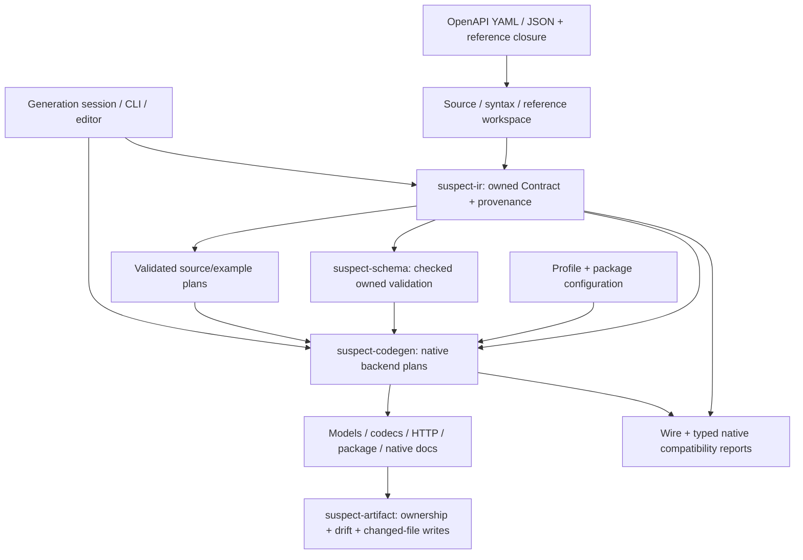

# Contract-backed SDK compiler

The SDK compiler derives API semantics from OpenAPI and generates native
models, checked codecs, HTTP clients, installable packages, examples and
documentation. The [capability matrix](SDK-CAPABILITIES.md) lists the twelve
experimental native profiles.

## Product contract

1. **One semantic source.** Endpoints, schemas, wire names, security and examples
   come from OpenAPI. Package identity and runtime/presentation options are
   target configuration.
2. **Faithful runtime behavior.** Native types express representable constraints;
   codecs and validation enforce supported remaining constraints, including
   exact values, absence/null and exclusive unions.
3. **Explicit admission.** Unsupported selected declarations produce located
   diagnostics before output. Generation, preview and comparison use the same
   target admission boundaries.
4. **Native interfaces.** Shared semantic plans and vectors support idiomatic
   ecosystem-specific APIs. Emitters consume allocated symbols and typed plans.
5. **Documentation is an artifact.** Native comments, references and examples
   use the same plans and source identities as generated code.
6. **Reproducibility.** Source closure, configuration and generator/runtime
   assets determine output. The writer tracks ownership and preserves unchanged
   file bytes and metadata.

## Pipeline



`suspect_ir::contract::Contract` owns normalized values, schema/reference edges,
effective HTTP metadata and physical source addresses. The lossless reader and
explicit Fast reader have independent parity checks. Resource URIs, anchors and
dynamic-reference scope remain distinct from physical document identity.

Reference acquisition is explicit. Local split specs and
[hash-pinned offline closures](SDK-PINNED-CLOSURE-DESIGN.md) feed the same
compiler. An HTTP URI used as a schema identifier does not authorize retrieval.

`backend::generate(Arc<Contract>, selected_sources, TargetConfig)` is the shared
dispatch boundary. Language plans own symbols, models, codecs, operation
inputs/results, dependencies and diagnostics. Model-only and codec-only library
APIs expose useful layers; HTTP profiles admit their complete selected closure.

The [artifact writer](SDK-ARTIFACT-OWNERSHIP.md) preflights the complete desired
file set. Unchanged output retains metadata; unedited obsolete owned files can
be removed. Drift checking is read-only. Replacement is atomic per file.

## Commands and migration

```sh
suspect codegen-profiles --format json
suspect codegen api.openapi.yaml --profile typescript-http \
  --package-name @example/sdk --package-version 1.0.0 --out generated
suspect codegen-session --config sdk-session.json --out generated --preview --format json
suspect codegen-compare --before baseline/sdk-session.json --after candidate/sdk-session.json
```

Package name and version are explicit. Repeated `--operation-id` selectors use
exact source IDs; omission attempts every outgoing operation. The
[session guide](SDK-INCREMENTAL-GENERATION.md) documents multi-target JSON,
bounded reuse, watch/check/preview and editor integration.

This replaces the earlier `suspect-codegen` STG/lift/standalone emitter APIs and
their prototype consumer-impact and semantic-diff implementations. Library
users should migrate to `Contract`, `backend` and `compatibility`.

The old `suspect gen --preset ts-sdk` and `--preset rust-sdk` presets are
replaced by `suspect codegen --profile typescript-http` and `rust-http` with
explicit package configuration. `suspect-gen` continues to render `docs-md` and
custom manifests over the platform `IrSpec`. The CLI's structural `suspect diff`
command remains available; SDK wire/native migration analysis uses
[`codegen-compare`](SDK-COMPATIBILITY-REPORTS.md).

## Verification

The ordinary workspace gates use in-repository fixtures and controlled
transports. Use the Node/npm versions pinned in
`crates/suspect-codegen/tools/typescript-docs/`, then install the native
TypeScript test tools:

```sh
npm ci --prefix crates/suspect-codegen/tools/typescript-docs --ignore-scripts --no-audit --no-fund
export PATH="$PWD/crates/suspect-codegen/tools/typescript-docs/node_modules/.bin:$PATH"
```

Run the workspace gates:

```sh
cargo fmt --all --check
cargo clippy --workspace --all-targets --locked -- -D warnings
cargo test --workspace --locked
RUSTDOCFLAGS='-D warnings' cargo doc --workspace --no-deps --locked
cargo bench --workspace --locked -- --test
```

Tests cover parser parity and exact values; schema dialects, applicators and
resources; source-located diagnostics; artifact ownership; generation sessions;
and source/native compatibility. Installed native consumers and external-corpus
regressions are opt-in ignored tests with their tool/input requirements stated
on each test. Compiler tests and generated-package runtime tests establish
different boundaries.

For VS Code, build the CLI with `cargo build --locked -p suspect-cli` and set
`SUSPECT_TEST_BINARY` to its absolute path. Run `npm ci`, `npm run compile`,
`npm run test:generation` and `npm run test:generation:host:inputs` in
`editors/vscode`. Real extension-host checks require the explicit inputs
documented by its native-host harness.

The [session measurement guide](SDK-SESSION-PERFORMANCE.md) defines cold, warm,
edited and reverted snapshot boundaries. Functional reuse and zero-rewrite
checks establish correctness; numerical latency claims require qualified
repeated measurements.
