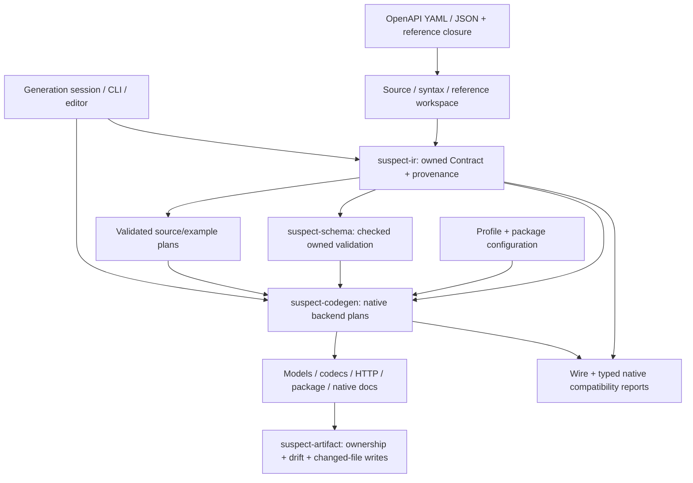

# OpenAPI-driven SDK generation plan

Authorized 2026-09-08; full-plan implementation resumed 2026-09-10.
OpenRouter's tracked `openrouter-web` specifications
are the primary acceptance workload. [SDK-PROGRESS.md](SDK-PROGRESS.md) records
current verification; [SDK-CAPABILITIES.md](SDK-CAPABILITIES.md) defines the
implemented profile boundaries.

## Goal and current scope

Generate language-native SDKs with faithful types and HTTP behavior, checked
codecs, installable packages, executable examples and native documentation.
OpenAPI is the complete source of API semantics.

The default registry now contains **Python, Go, Swift, Rust, TypeScript/JavaScript,
Java, C#, Kotlin, Ruby, PHP, Dart and C++**. Each has native base-profile evidence.
The verified five-language hackathon deliverable remains the M3/native-parity and
M6 iteration-tool baseline. The user's resumed instruction covers all remaining
original-plan work end to end; protocol, schema, acquisition, compatibility and
maintenance gates are tracked in
[SDK-FULL-PLAN-WORK.md](SDK-FULL-PLAN-WORK.md). Approved native interfaces remain in
[SDK-REMAINING-DX.md](SDK-REMAINING-DX.md).

M0–M2 completion is a historical checkpoint, recorded in
[SDK-M0-M2-EXIT.md](SDK-M0-M2-EXIT.md). The sealed post-cleanup native run verifies
M3 and all 208 demo-relevant generation/SDK/iteration criteria. The original
four numerical M6 criteria remain unmet and are deferred from the demo by user
decision. See [SDK-DEMO.md](SDK-DEMO.md) and [current evidence](SDK-PROGRESS.md).

## Product contract

1. **One semantic source.** Endpoints, schemas, wire names, security, examples
   and API-specific behavior originate in OpenAPI. Package identity, runtime
   versions and presentation are target configuration.
2. **Faithfulness includes runtime behavior.** Native types express what the
   language can represent. Codecs/validation enforce the remaining supported
   constraints, including exact numbers, absence/null and `oneOf` exclusivity.
3. **Explicit admission.** Each feature is represented exactly, faithfully
   enforced at runtime, or rejected with a source-linked diagnostic. Preview
   uses the same admission boundary as generation.
4. **Native public interfaces.** Share semantic decisions and test vectors;
   design public APIs for each ecosystem. Ordinary valid calls should not need
   unsafe casts, reflection or manual request assembly.
5. **Documentation is an artifact.** Code, native comments, browsable references
   and examples use the same typed language plan and source identities.
6. **Reproducibility.** Pinned source closures, generator/runtime assets and
   configuration determine output. Regeneration tracks ownership and preserves
   unchanged file bytes/mtimes/inodes.

Optional versioned `x-*` metadata may express semantics absent from the standard.
Standard-only operation remains first-class. Pagination, retries, authentication
flows, streaming and defaults must not be inferred from suggestive names.

## One SDK pipeline



### Contract compilation

`suspect_ir::contract::Contract` owns normalized values, finite schema/reference
edges, effective HTTP metadata and source addresses. SDK backends consume it
directly. `Contract::from_workspace` uses the lossless reader; the explicit Fast
reader independently materializes supported values and checks parity against
the lossless source/reference sidecar.

Reference acquisition is separate from compilation. Local split specs are
supported; remote acquisition/offline-cache policy is designed in
[SDK-PINNED-CLOSURE-DESIGN.md](SDK-PINNED-CLOSURE-DESIGN.md). An HTTP URI used as an
identifier is not a command to download a document.

### Native planning and emission

`backend::generate(Arc<Contract>, selected_sources, TargetConfig)` is the shared
dispatch boundary. Language plans own allocated symbols, wire/native bindings,
models, codecs, operation inputs/results, dependencies and diagnostics.
Renderers and documentation consume these typed plans. They do not infer a
second API from emitted language text.

Model-only and codec-only library APIs expose useful layers of this pipeline.
Model-only plans retain their validation/codec obligations; HTTP profiles admit
their complete selected closure before returning a package.

### Artifact lifecycle

The writer receives the complete desired artifact set. Preflight validates
paths, ownership and conflicts before publication. Unchanged files keep their
metadata; only unchanged obsolete owned files can be removed. `--check` is
read-only. Atomic replacement is per file, not a whole-batch transaction or
cross-process lock. See [SDK-ARTIFACT-OWNERSHIP.md](SDK-ARTIFACT-OWNERSHIP.md).

`suspect-gen` provides `docs-md` and custom manifest/template rendering over the
platform `IrSpec`. Native SDK packaging and documentation belong to the typed
backend pipeline.

## User workflow

```sh
suspect codegen crates/suspect-codegen/tests/fixtures/m2/canonical.openapi.yaml \
  --profile typescript-http --package-name @example/widgets \
  --package-version 0.1.0 --out generated
```

Use `suspect codegen-profiles --format json` to discover the exact compiled
registry. Default profiles are `python-http`, `go-http`, `swift-http`, `rust-http`,
`typescript-http`, `java-http`, `csharp-http`, `kotlin-http`, `ruby-http`, `php-http`,
`dart-http` and `cpp-http`.
Package name and exact version are required. Repeat `--operation-id NAME` to
select exact outgoing operations; omission attempts all of them. Add
`--check --format json` for read-only ownership/drift results.

[`codegen-session`](SDK-INCREMENTAL-GENERATION.md) selects multiple profiles in
one JSON configuration and shares a Contract across them. It supports finite
generation, check, preview and persistent watch. The editor uses the same CLI
and protocol. [`codegen-compare`](SDK-COMPATIBILITY-REPORTS.md) compares two
source/configuration snapshots and emits JSON or Markdown migration notes.

Generation is independent of installed native toolchains. Native build/install,
documentation and consumer execution are separate verification gates.

## Fidelity and protocol growth

Normative references are in [SDK-OPENAPI-RESEARCH.md](SDK-OPENAPI-RESEARCH.md).
Current HTTP profiles include each target's independently witnessed expansion of
the original JSON/exact-status/bearer/static-server slice. Shared OAS3.0/3.1/3.2
indexing and owned compilation remain distinct from native capability acceptance.

| Concern | Required behavior |
| --- | --- |
| Presence and null | Distinguish required non-null, required nullable, optional non-null and optional nullable; preserve omission during encode/decode |
| Direction | Apply an explicit dialect-aware request/response policy and preserve annotations; supplied fields remain validated under the TS 3.1 policy |
| Composition | Preserve intersection, inclusive union and exactly-one validation; flatten only with an equivalence proof |
| Objects and arrays | Preserve named fields, typed/untyped extras, recursive identity and supported collection constraints |
| Exact values | Preserve numeric tokens and mathematical integrality; use bounded native numbers only when the schema proves the range |
| References | Keep source/resource identity, escaped pointers, local/external closure and recursion; unsupported scope/dialect behavior must fail explicitly |
| HTTP | Derive method, URL, encoding, requiredness, security, status and media from effective declarations; retain typed errors and bounded unexpected-response captures |
| Resources | Propagate cancellation, bound request/response/evaluation work, and validate mutable models again on encode |
| Examples | Validate declared examples, retain provenance/findings, and label synthesized replacements separately |

The shared protocol now represents parameter/security encodings, status
ranges/defaults, no-content and binary responses, forms/multipart, typed headers,
and item streaming. Native completion and broader applicator/resource execution
follow the source-backed contracts in
[SDK-PROTOCOL-NEXT.md](SDK-PROTOCOL-NEXT.md) and
[SDK-NATIVE-DX.md](SDK-NATIVE-DX.md) require their own native gates before admission.
Expanding a shared shape must not silently expand every backend's support claim.

## Verification gates

The maintained twelve-language integrated runner is `xtask sdk-full`; its exact
configuration and required evidence are in [SDK-FULL-EXIT.md](SDK-FULL-EXIT.md).
`sdk-m3-m6` retains the historical five-language scope and numerical policy.

| Gate | Acceptance requirement |
| --- | --- |
| Contract | Independent YAML/JSON, reordered, split, recursive, scalar and invalid-source cases preserve semantics and locations |
| Native packages | Installed consumers build under declared floor/current toolchains with actual emitted bytes and no manual repairs |
| Types and codecs | Positive/negative native types, exact round trips, omission/null, union membership and mutable-model validation |
| Wire | Independent recording fixtures assert method, URL/query/header bytes, body, security, status/media and decoding |
| Runtime | Cancellation, cleanup, encoding, finite resource policies and security regressions execute in each native runtime |
| Docs/examples | Native rendered docs resolve actual symbols and source bindings; packaged examples compile and execute |
| Artifacts/session | Determinism, zero unchanged rewrites/replans, complete source/config invalidation, bounded caching and conflict handling |
| Compatibility | Separate native and wire changes, source evidence, migration notes and explicit unknown results |
| Quality | Workspace tests, all-target warnings-denied Clippy, warnings-denied Rustdoc and formatting |
| Performance | Qualified baseline/candidate measurements, reproducible provenance and the versioned numerical regression policy |

Use the tracked OpenRouter inputs plus independent normative/adversarial
fixtures. Source validation findings remain visible separately from
selected-operation SDK admission. A historical failed-stage classification is
not a current workflow requirement. New reports use fresh paths and record the
actual source, binary, tool inventory and command outcomes.

## Speed: measure the complete workflow

Sessions already provide SHA-256 closure/config identity, one owned Contract per
accepted snapshot, finite LRU reuse, target-only configuration invalidation,
cached reverts and missing-reference recovery. Source edits currently invalidate
the complete relevant snapshot; finer internal reuse requires measured benefit.

Measure cold, warm unchanged, schema, operation and docs-only changes across
small, split-recursive and real OpenRouter inputs. Record generation phases,
file/byte counts, writes, native build/docs costs, runtime/import/codec behavior
and RSS with their actual boundaries. The prepared-template throughput floor is
a narrow rendering check, not end-to-end SDK performance.

The initial candidate regression policy is to investigate **>10% beyond measured
noise**. Qualified baseline/candidate evidence must establish the numerical
gate; smoke execution alone is not a p95 result.

**Current disposition:** five complete Mac baseline suites were collected. Work
and size metrics were stable, while timing noise prevented qualification under
the candidate policy. No candidate run followed. The user chose generation and
output SDKs as the hackathon deliverable, so these timings remain observational.
Future numerical p95 acceptance requires prospectively agreed controls/policy
and fresh qualifying evidence; the preserved baseline is not relabeled passing.
See [SDK-SESSION-PERFORMANCE.md](SDK-SESSION-PERFORMANCE.md).

## Delivery sequence

| Work | Current state / next gate |
| --- | --- |
| M0–M2 foundations and TS/JS–Rust vertical | Historical completion; immutable reports indexed in `SDK-M0-M2-EXIT.md` |
| M3 Python/Go/Swift/Rust with TS/JS baseline | Verified by the sealed post-cleanup native/package/docs/runtime matrix |
| M6 sessions/editor/compatibility/performance | Iteration tools delivered for the hackathon; timing observational, original strict numerical exit deferred |
| Java/C#/Kotlin/Ruby/PHP/Dart/C++ | Native base profiles verified and registered; final twelve-target integrated acceptance pending |
| Protocol/dialect expansion | Native protocol witnesses recorded per language; scoped v2/resource execution advances through explicit native gates |
| Terraform Provider generation | User-added stretch goal (2026-09-10), after core SDK work; [scope and acceptance](SDK-TERRAFORM-STRETCH.md) |

The initial review and old milestone reports remain under `target/sdk-m0-m2*`
and the earlier acceptance archives. They describe their pinned historical
implementation. Current scope and decisions live in this plan, the capability
matrix, [progress](SDK-PROGRESS.md) and [handoff](SDK-SESSION-HANDOFF.md).
